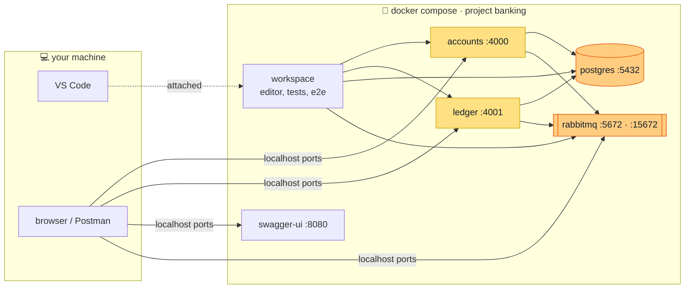

# Banking lab · Event Sourcing in Elixir


> 🧪 **This is a learning lab.** I built it to learn Event Sourcing, CQRS and DDD on a small
> core-banking domain: accounts, money transfers and a double-entry ledger.
> I'm sharing it as a **reference** for anyone walking the same path, and I'd love your
> **feedback** ([how to give it](#feedback)).

## The idea in one picture

Two bounded contexts, each one its own Phoenix service with its own event store. They share no code
and no database, and they talk only through RabbitMQ.


A transfer reserves money in `accounts`, is booked in the `ledger`, and is then confirmed or
compensated. There is no distributed transaction, only events and a saga.

## Where to go next

### 📐 The design: [`docs/event_storming.md`](docs/event_storming.md)

Start here to understand *why* the code looks the way it does.

| I want to… | Read |
| --- | --- |
| Learn the sticky-note colors | [1 · Legend](docs/event_storming.md#1-sticky-note-legend) |
| See an account's life at a glance | [2 · Big Picture](docs/event_storming.md#2-big-picture--timeline-of-the-pivotal-events) |
| Understand the account FSM | [3 · Account Management](docs/event_storming.md#3-process-level--account-management-context) |
| Understand the double-entry ledger | [4 · Ledger](docs/event_storming.md#4-process-level--ledger-context) |
| Follow a transfer end to end, including failures | [5 · TransferMoney flow](docs/event_storming.md#5-design-level--end-to-end-transfermoney-flow) |
| See how the two contexts relate | [6 · Context Map](docs/event_storming.md#6-context-map) |
| Browse every command, event and policy | [7 · Inventory](docs/event_storming.md#7-inventory-of-commands-events-and-aggregates) |
| See the open questions and how each was settled | [8 · Hotspots](docs/event_storming.md#8-hotspots--open-decisions) |
| Read the trade-offs (D1…D15) | [10 · Design decisions](docs/event_storming.md#10-design-decisions) |

### 🧩 The services

Each service has its own README with how it works inside.

| | [🏦 accounts](apps/accounts/README.md) | [📒 ledger](apps/ledger/README.md) |
| --- | --- | --- |
| Role | Account lifecycle, available balance, transfer saga | Immutable double-entry book, source of truth for balances |
| Tech stack | [Stack](apps/accounts/README.md#tech-stack) | [Stack](apps/ledger/README.md#tech-stack) |
| Run in dev | [Guide](apps/accounts/README.md#run-in-dev) | [Guide](apps/ledger/README.md#run-in-dev) |
| HTTP API + Swagger download | [API](apps/accounts/README.md#http-api) | [API](apps/ledger/README.md#http-api) |
| Aggregates | [CustomerAccount](apps/accounts/README.md#aggregate) | [TransactionBatch · LedgerAccount](apps/ledger/README.md#aggregates) |
| Commands | [13 commands](apps/accounts/README.md#commands) | [3 commands](apps/ledger/README.md#commands) |
| Events | [15 events](apps/accounts/README.md#events) | [4 events](apps/ledger/README.md#events) |
| Database tables | [Tables](apps/accounts/README.md#database-tables) | [Tables](apps/ledger/README.md#database-tables) |
| Queues | [Queues](apps/accounts/README.md#queues) | [Queues](apps/ledger/README.md#queues) |

### 🎬 The stories: [`apps/e2e`](apps/e2e/README.md)

End-to-end tests that drive both running services through their APIs and RabbitMQ: deposits,
transfers, compensation, closing, and redelivered messages. Each one checks that both books agree.

| I want to… | Read |
| --- | --- |
| See how a story test works | [How a story works](apps/e2e/README.md#how-a-story-works) |
| Run the suite | [Run it](apps/e2e/README.md#run-it) |
| Browse what is covered | [Stories](apps/e2e/README.md#stories) |
| Replay them by hand in Postman | [Replay them in Postman](apps/e2e/README.md#replay-them-in-postman) |

## Run it locally

> 🐳 **Only Docker is needed.** Elixir, Postgres, RabbitMQ and Node all run in containers, so
> nothing else goes on your machine.

### What you need

| | Tool | Why |
| --- | --- | --- |
| ✅ | [Docker](https://docs.docker.com/get-docker/) (Engine 25+ or Docker Desktop) | runs everything |
| ⭐ | [VS Code](https://code.visualstudio.com/) + [Dev Containers](https://marketplace.visualstudio.com/items?itemName=ms-vscode-remote.remote-containers) extension | the editor inside the container (optional) |

### Open it in the dev container

1. Clone the repo and open the folder in VS Code.
2. When VS Code offers **Reopen in Container**, click it. You can also run it from the command
   palette (`F1` → *Dev Containers: Reopen in Container*).
3. Wait for the first build. It builds the dev image and compiles both services, so it takes a
   few minutes. Later starts take seconds.
4. Once the window reopens, the terminal is inside the `workspace` container, in `/workspace`,
   and both services are already running.

Check that everything is up:

```bash
curl -s http://ledger:4001/api/trial-balance      # {"balanced":true, ...}
```

> 🧩 **Bring your own extensions.** The container comes with the Elixir, Phoenix, YAML and
> Mermaid extensions from [`devcontainer.json`](.devcontainer/devcontainer.json). Themes and
> keymaps keep working from your machine. To add the extensions you use locally, such as an AI
> agent:
>
> - **Once:** open the command palette (`F1`), search for *Install Local Extensions*, and pick
>   the ones you want. The Extensions view has the same action behind its cloud button.
> - **Every time:** list them in your own VS Code user settings. They are then installed in
>   every dev container on top of the defaults:
>
>   ```jsonc
>   "dev.containers.defaultExtensions": ["anthropic.claude-code", "eamodio.gitlens"]
>   ```

### What starts



- **ledger** starts first. Its `mix setup` creates the databases and seeds the bank's
  `pix-settlement` account, and it declares the RabbitMQ queue that accounts sends commands to.
- **accounts** starts once the ledger is healthy.
- Both run from the mounted source code, so an edit reloads on the next request.
- Each app keeps its `deps`, `_build` and dialyzer PLTs in Docker volumes, so they never mix
  with a build on your machine.

The same ports are published on your machine:

| Service | From your machine | From the workspace container |
| --- | --- | --- |
| 🏦 accounts API | http://localhost:4000/api | http://accounts:4000/api |
| 📒 ledger API | http://localhost:4001/api | http://ledger:4001/api |
| 📖 Swagger UI (both specs) | http://localhost:8080 | · |
| 🐇 RabbitMQ management | http://localhost:15672 (`banking` / `banking`) | http://rabbitmq:15672 |
| 🐘 Postgres | `localhost:5432` (`postgres` / `postgres`) | `postgres:5432` |

### Work inside the container

The workspace container already points `PGHOST`, `RABBITMQ_URL`, `ACCOUNTS_URL` and `LEDGER_URL`
at the other containers, so the usual commands just work:

| I want to… | Run |
| --- | --- |
| 🧪 Run a service's tests | `cd apps/accounts && mix test` (or `apps/ledger`) |
| 🔍 Run the quality checks | `mix quality` in the service's folder |
| 🎬 Run the e2e stories | `cd apps/e2e && mix test` |
| 📮 Replay the Postman collection | `newman run apps/e2e/postman/banking.postman_collection.json -e apps/e2e/postman/devcontainer.postman_environment.json` |
| 📐 Lint an OpenAPI spec | `npx @redocly/cli@1 lint apps/accounts/priv/openapi.yaml` |
| 🐘 Open a SQL shell | `psql -U postgres -d accounts_dev` (password `postgres`) |

The services' logs don't go to this terminal. Follow them from your machine with
`docker compose logs -f accounts ledger`.

### Without VS Code

The same containers run with Docker alone. From the repo root:

```bash
# The whole stack plus the workspace container
docker compose -f docker-compose.yml -f .devcontainer/compose.yaml up -d --wait

# A shell inside it, for the commands above
docker compose -f docker-compose.yml -f .devcontainer/compose.yaml exec workspace bash
```

To run only the services and use them from your machine, `docker compose up -d --wait` is
enough.

### Stop, reset, troubleshoot

| Situation | Do |
| --- | --- |
| ⏸️ Stop everything, keep the data | `docker compose down` (VS Code also stops it when you close the window) |
| 🧹 Start from scratch: data, deps and builds | `docker compose down -v` |
| 🐢 `--wait` or VS Code seems stuck on the first run | it is compiling: `docker compose logs -f ledger accounts` |
| 🚫 A port is already in use (5432, 5672, 4000…) | stop whatever is using it on your machine, e.g. a local Postgres |
| 🔁 Changed the Dockerfile or `devcontainer.json` | *Dev Containers: Rebuild Container* |

Prefer your own Elixir on the host? Each service's [run in dev](apps/accounts/README.md#run-in-dev)
guide shows how to run just the infrastructure in Docker.

## Repository layout

```
.
├── docs/event_storming.md   # the design: event storming, context map, decisions D1…D15
├── apps/
│   ├── accounts/            # Account Management Context (Phoenix service)
│   ├── ledger/              # Ledger Context (Phoenix service)
│   └── e2e/                 # story tests across both running services
├── .devcontainer/           # dev image and the workspace container for VS Code
├── docker-compose.yml       # the whole stack: Postgres, RabbitMQ, Swagger UI, both services
└── CLAUDE.md                # conventions for AI-assisted work on the repo
```

## Feedback

This is a study project, so questions and critiques are the point. 💬

- Something in the model looks wrong, or you would have decided a [trade-off](docs/event_storming.md#10-design-decisions) differently? Open an issue.
- A hotspot I missed? I'd love to hear about it.
- Found it useful? A ⭐ tells me it helped.
