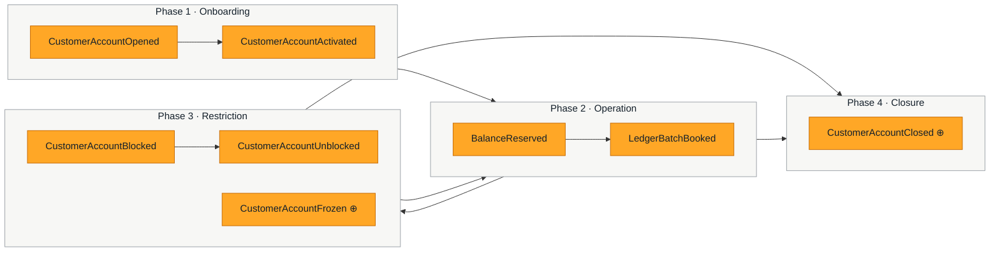
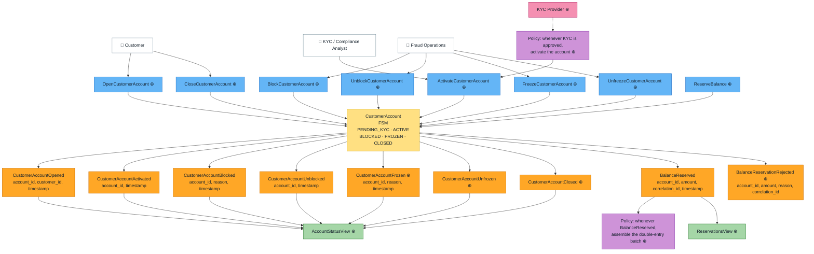
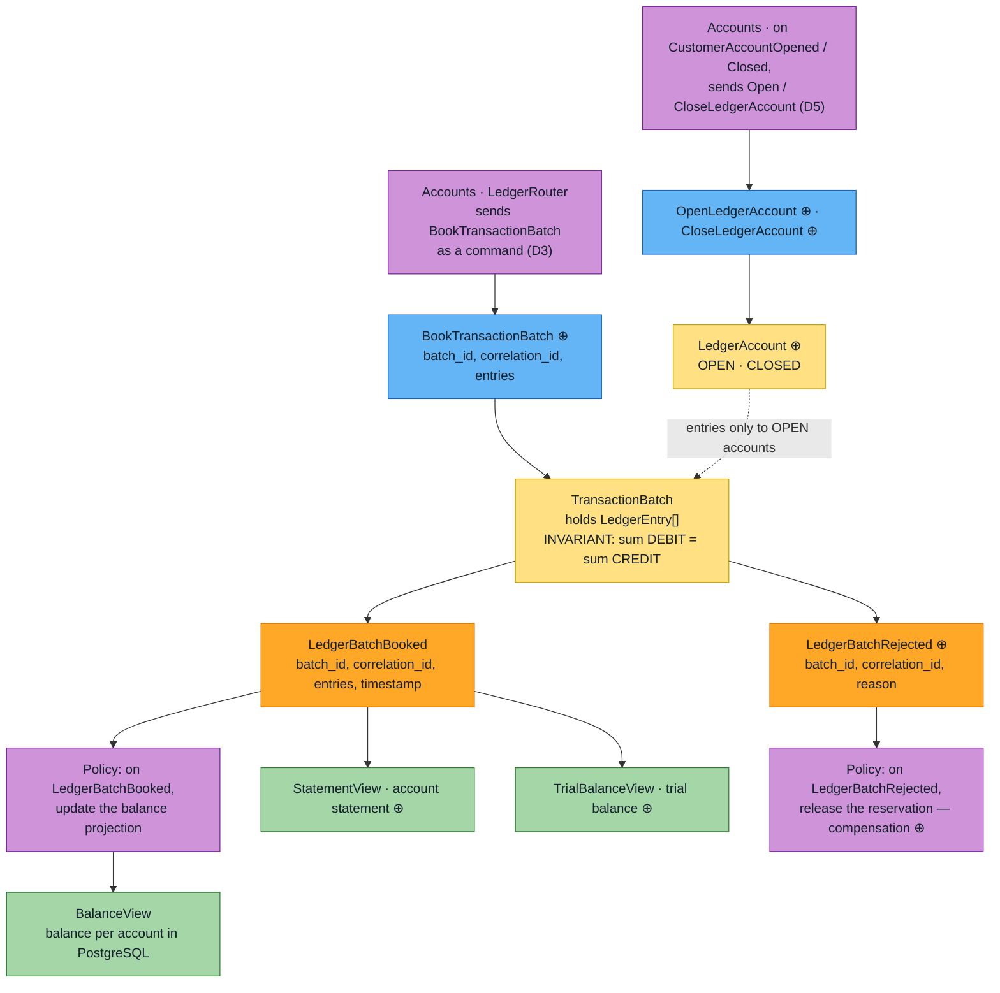
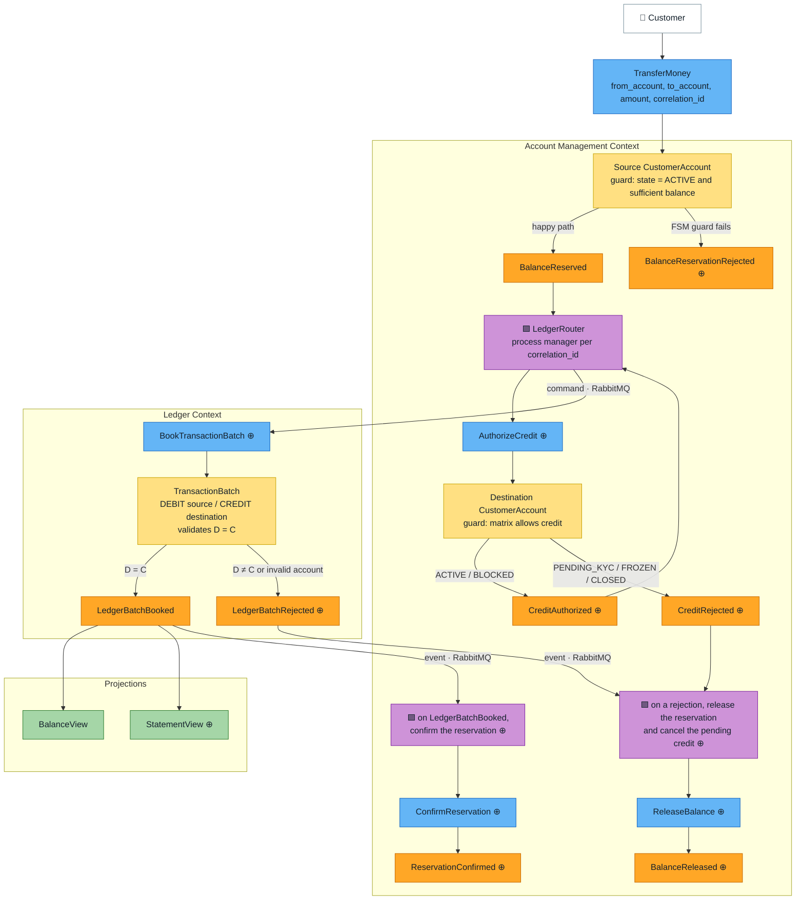
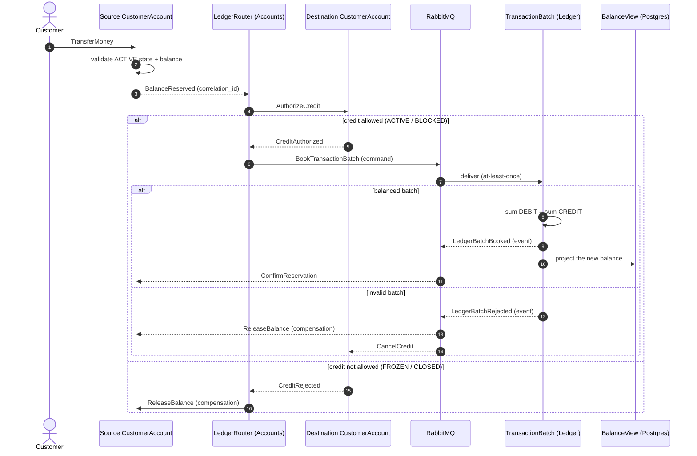
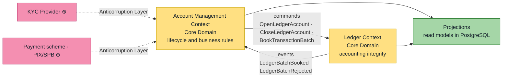

# Event Storming — Core Banking (DDD + CQRS/ES)

Design artifact for the lab in Alberto Brandolini's Event Storming format, from the *Big Picture*
down to the *Design Level*.

> **Provenance convention:** elements marked with **⊕** do not appear in the specification's event
> dictionary — they are proposals derived from the FSM, the invariants and the compensation flow.
> Everything unmarked comes straight from the spec.

---

## 1. Sticky note legend

| Color | Element | Meaning | Question it answers |
| --- | --- | --- | --- |
| 🟧 Orange | **Domain Event** | An immutable fact in the past. This is what goes into the Event Store. | What happened? |
| 🟦 Blue | **Command** | An intent to change; it may be rejected. | What was requested? |
| 🟨 Yellow | **Aggregate** | Guardian of the invariants; turns command → event. | Who decides? |
| 🟪 Lilac | **Policy / Process Manager** | "Whenever X, then Y". Asynchronous reaction. | What reacts? |
| 🟩 Green | **Read Model / Projection** | Materialized view for querying. | What gets queried? |
| 🟥 Red | **Hotspot** | Doubt, conflict or pending decision. | What don't we know yet? |
| 🟫 Pink | **External System** | Outside our bounded contexts. | Who is outside? |
| ⬜ White | **Actor / UI** | Person or interface that triggers the command. | Who starts it? |

---

## 2. Big Picture — timeline of the pivotal events

Chronological order of an account's life, ignoring command and aggregate detail.



**Pivotal events (phase dividers):** `CustomerAccountActivated` opens up transactional capability;
`CustomerAccountClosed` ends it for good. Every swing between `ACTIVE`, `BLOCKED` and `FROZEN`
happens inside the operational cycle.

---

## 3. Process Level — `Account Management Context`

Scope: account lifecycle, limits, status and business rules.
The `CustomerAccount` aggregate is implemented as an FSM.



### 3.1 FSM invariants

The specification's matrix, translated into the aggregate's guard rules:

| State | Debit (outbound) | Credit (inbound) | Allowed transitions |
| --- | :---: | :---: | --- |
| `PENDING_KYC` | ❌ | ❌ | → `ACTIVE` |
| `ACTIVE` | ✅ | ✅ | → `BLOCKED`, `FROZEN`, `CLOSED` |
| `BLOCKED` | ❌ | ✅ | → `ACTIVE`, `CLOSED` |
| `FROZEN` | ❌ | ❌ | → `ACTIVE` |
| `CLOSED` | ❌ | ❌ | terminal |

- `ReserveBalance` only produces `BalanceReserved` if the state is `ACTIVE` **and** there is
  available balance; otherwise, `BalanceReservationRejected` ⊕.
- A transition not covered by the matrix produces no event — the command is rejected
  (`{:error, reason}`) and never written to the Event Store.
- `FROZEN` is the only state that blocks credit **and** debit; `BLOCKED` blocks debit only.

---

## 4. Process Level — `Ledger Context`

Scope: immutable double-entry ledger. `Ledger` knows no other context: it takes commands and
publishes its own events (D3, D5).



### 4.1 The critical invariant

```
sum(Amount of all DEBITs) - sum(Amount of all CREDITs) = 0
```

Validated **inside** the `TransactionBatch` aggregate, before emitting `LedgerBatchBooked`.
An unbalanced batch is never persisted as a success event — it becomes
`LedgerBatchRejected` ⊕, which is the trigger for compensation.

---

## 5. Design Level — end-to-end `TransferMoney` flow

Detail of the flow in section 5 of the specification, including the failure path, as refined by
D3 and D5: the saga lives in `Account Management`, the destination account authorizes the credit,
and `Ledger` only receives a command.



### 5.1 Time sequence — success and compensation



The reservation in `Account Management` is the mechanism that replaces the distributed
transaction: between `BalanceReserved` and `ReservationConfirmed`/`BalanceReleased` the system sits
in eventual consistency, and the `correlation_id` is what stitches the saga together.

---

## 6. Context Map



`Account Management` and `Ledger` relate to each other through **asynchronous messages**, with no
synchronous call and no shared database. `Ledger` is an **Open Host Service**: it publishes a
command contract and its own events, and knows nothing of `Account Management`, which conforms to
that contract. The dependency runs one way only (D3, D5).

---

## 7. Inventory of commands, events and aggregates

### Account Management

| Command | Aggregate | Success event | Rejection event/error | Guard |
| --- | --- | --- | --- | --- |
| `OpenCustomerAccount` ⊕ | `CustomerAccount` | `CustomerAccountOpened` | account already exists | — |
| `ActivateCustomerAccount` ⊕ | `CustomerAccount` | `CustomerAccountActivated` | rejected | state = `PENDING_KYC` |
| `BlockCustomerAccount` ⊕ | `CustomerAccount` | `CustomerAccountBlocked` | rejected | state = `ACTIVE` |
| `UnblockCustomerAccount` ⊕ | `CustomerAccount` | `CustomerAccountUnblocked` | rejected | state = `BLOCKED` |
| `FreezeCustomerAccount` ⊕ | `CustomerAccount` | `CustomerAccountFrozen` ⊕ | rejected | state = `ACTIVE` |
| `UnfreezeCustomerAccount` ⊕ | `CustomerAccount` | `CustomerAccountUnfrozen` ⊕ | rejected | state = `FROZEN` |
| `CloseCustomerAccount` ⊕ | `CustomerAccount` | `CustomerAccountClosed` ⊕ | rejected | state ∈ {`ACTIVE`, `BLOCKED`}, zero available balance, no open reservation, no pending credit (D8) |
| `ReserveBalance` ⊕ | `CustomerAccount` | `BalanceReserved` | `BalanceReservationRejected` ⊕ | `ACTIVE` + available balance |
| `ConfirmReservation` ⊕ | `CustomerAccount` | `ReservationConfirmed` ⊕ | — | reservation exists |
| `ReleaseBalance` ⊕ | `CustomerAccount` | `BalanceReleased` ⊕ | — | reservation exists |
| `AuthorizeCredit` ⊕ | `CustomerAccount` | `CreditAuthorized` ⊕ | `CreditRejected` ⊕ | matrix allows credit: `ACTIVE`, `BLOCKED` (D5) |
| `PostCredit` ⊕ | `CustomerAccount` | `CreditPosted` ⊕ | — (a posted `correlation_id` is ignored, D4) | none: mirrors a credit the Ledger booked (D2) |
| `CancelCredit` ⊕ | `CustomerAccount` | `CreditCancelled` ⊕ | — (an unknown `correlation_id` is ignored, D4) | pending credit exists |

### Ledger

| Command | Aggregate | Success event | Rejection event | Invariant |
| --- | --- | --- | --- | --- |
| `BookTransactionBatch` ⊕ | `TransactionBatch` | `LedgerBatchBooked` | `LedgerBatchRejected` ⊕ | sum DEBIT = sum CREDIT, entries only to `OPEN` ledger accounts |
| `OpenLedgerAccount` ⊕ | `LedgerAccount` ⊕ | `LedgerAccountOpened` ⊕ | — (an existing account ignores it, D4) | — |
| `CloseLedgerAccount` ⊕ | `LedgerAccount` ⊕ | `LedgerAccountClosed` ⊕ | account not found (a closed account ignores it, D4) | state = `OPEN` |

### Policies

| Trigger | Policy | Command issued |
| --- | --- | --- |
| `BalanceReserved` | `LedgerRouter` (Accounts) | `AuthorizeCredit` ⊕ on the destination account |
| `CreditAuthorized` ⊕ | `LedgerRouter` (Accounts) | `BookTransactionBatch` ⊕, sent to `Ledger` |
| `CreditRejected` ⊕ | saga compensation ⊕ | `ReleaseBalance` ⊕ |
| `CustomerAccountOpened` / `Closed` | chart of accounts ⊕ (Accounts) | `OpenLedgerAccount` / `CloseLedgerAccount` ⊕, sent to `Ledger` |
| `LedgerBatchBooked` | saga confirmation ⊕ | `ConfirmReservation` ⊕ on the source account |
| `LedgerBatchBooked` | credit posting ⊕ | `PostCredit` ⊕ on each credited customer account |
| `LedgerBatchRejected` | saga compensation ⊕ | `ReleaseBalance` ⊕ on the source, `CancelCredit` ⊕ on the destination |
| KYC approved | account activation ⊕ | `ActivateCustomerAccount` ⊕ |

### Read models

| Projection | Fed by | Use |
| --- | --- | --- |
| `BalanceView` | `LedgerBatchBooked` | queryable balance per account |
| `AccountStatusView` ⊕ | lifecycle events | FSM status and history |
| `ReservationsView` ⊕ | `BalanceReserved`, `ReservationConfirmed`, `BalanceReleased` | open reservations, available balance |
| `StatementView` ⊕ | `LedgerBatchBooked` | statement per account |
| `TrialBalanceView` ⊕ | `LedgerBatchBooked` | trial balance, proof of double entry |

---

## 8. Hotspots — open decisions

Red sticky notes raised during modeling. Each one is worth an invariant test once resolved.

| # | Hotspot | Why it matters |
| --- | --- | --- |
| H1 | **Owner of the chart of accounts.** Does `Ledger` know the customer's accounting accounts, or does it receive the identifiers in the event payload? | Determines whether `CustomerAccountOpened` has to trigger the creation of accounting accounts. **Resolved → D5.** |
| H2 | **Credit into a `BLOCKED` account.** The matrix allows inbound money, but credits don't go through a reservation. Who authorizes the entry? | If `Ledger` doesn't check the status, `BLOCKED` is only enforced on debits. **Resolved → D5.** |
| H3 | **Reservation timeout.** Does a `BalanceReserved` with no matching `LedgerBatchBooked` stay pending forever? | Without expiry, available balance leaks. Calls for a scheduler or a `ReservationExpired` event. **Resolved → D6.** |
| H4 | **Idempotency.** Is `correlation_id` the deduplication key in `Ledger`? | A PubSub redelivery could book the same batch twice. **Resolved → D4.** |
| H5 | **Freezing with an open reservation.** `FreezeCustomerAccount` during an in-flight saga: abort it or let it finish? | Affects the guards on `ConfirmReservation`. **Resolved → D7.** |
| H6 | **Residual balance at closure.** Does `CloseCustomerAccount` require a zero balance, or does it generate a transfer entry? | A terminal state holding a balance breaks reconciliation. **Resolved → D8.** |
| H7 | **Reversals.** An accounting batch is immutable — is a reversal a new, inverted batch? | Determines whether `LedgerBatchReversed` exists. **Model decided, implementation deferred → D9.** |
| H8 | **Projection failure.** `LedgerBatchBooked` written but `BalanceView` stale. | Needs projection replay and lag monitoring. |
| H9 | **Event transport between services.** `accounts` and `ledger` have separate event stores, so Commanded's PubSub does not carry `BalanceReserved` or `LedgerBatchBooked` across. Broker, outbox, or a subscription to the other event store? | Nothing crosses the Context Map until this is decided — it blocks `LedgerRouter` and the saga in section 5. **Resolved → D3.** |

---

## 9. From the diagram to the code

Each bounded context is its own Phoenix service, with its own Postgres database for read models
and its own event store. This departs from the single `lib/core_banking/` app in section 6 of the
specification: the two contexts share no code and no database, as the Context Map in section 6
above requires.

```
accounts/                          # Account Management Context
└── lib/accounts/
    ├── customer_account.ex        # 🟨 aggregate: FSM, transition matrix (section 3.1) and guards
    ├── commands/                  # 🟦 commands (section 7)
    ├── events/                    # 🟧 events (section 7)
    ├── process_managers/
    │   └── ledger_router.ex       # 🟪 transfer saga: credit authorization, booking, compensation
    └── projections/               # 🟩 AccountStatusView, ReservationsView

ledger/                            # Ledger Context
└── lib/ledger/
    ├── transaction_batch.ex       # 🟨 aggregate: D = C invariant (section 4.1)
    ├── ledger_account.ex          # 🟨 aggregate: OPEN · CLOSED (D5)
    ├── ledger_entry.ex            # DEBIT/CREDIT value object
    ├── commands/ · events/        # 🟦 🟧
    └── projections/               # 🟩 BalanceView, StatementView, TrialBalanceView
```

Each service has the same setup: Phoenix API, Ecto for the read models, Commanded with a
Postgres event store in its own database (`<App>.App`, `<App>.EventStore`), and the `mix quality`
gate. `CustomerAccount` and `TransactionBatch` exist so far; the rest of the tree is where each
piece goes.

**An aggregate's rules live in the aggregate.** The FSM guards are a module attribute of
`CustomerAccount`, next to the commands they guard, rather than a separate `state_machine.ex`, so
every rule of the aggregate reads from one file. They are keyed by command — the statuses each
command may run from, as in the Guard column of section 7 — not by target status: `Activate` and
`Unblock` both lead to `ACTIVE`, but from different statuses.

**Suggested implementation order:** the `CustomerAccount` FSM → the `TransactionBatch` double-entry
invariant → available balance and `ReserveBalance` in `CustomerAccount` → `AuthorizeCredit` and the
`LedgerAccount` lifecycle (D5) → message transport (D3) and the `LedgerRouter` saga wiring the two
together → projections. Every step before the transport is pure aggregate work, testable without
any infrastructure.
The specification's priority tests are exactly hotspots H2, H3 and H5, plus the mathematical
validation from section 4.1.

---

## 10. Design decisions

Decisions taken while implementing, to keep the lab close to a real service while staying lean.

### D1 · Money is an integer in cents

Amounts are integers in minor units: `10.00 BRL = 1_000`. Currency is fixed to BRL for now.

- Integer arithmetic is exact, and integers pass through the event store's JSON serializer
  unchanged (a `Decimal` would become a string).
- Two places match what payment schemes (PIX/SPB) settle, so no conversion or rounding is
  needed at their boundary.

### D2 · Two balances, one per context

| Balance | Owner | Meaning |
| --- | --- | --- |
| Ledger balance | `Ledger` | Sum of booked entries — the source of truth, shown by `BalanceView`. |
| Available balance | `CustomerAccount` | Ledger balance minus open reservations — what `ReserveBalance` checks. |

This is the authorization × posting split used by banks and card issuers. `CustomerAccount`
keeps its available balance in its own state, derived from its own events: booked credits raise
it, reservations hold it. It never queries `Ledger` synchronously.

Money enters an account the way it does in a real bank: a batch in `Ledger` debits a settlement
account (e.g. the bank's PIX account) and credits the customer, and `Accounts` learns about it
from `LedgerBatchBooked`.

### D3 · Messages cross services through RabbitMQ, with the event store as the outbox

`Ledger` knows no other context, so the two directions carry different kinds of message:

| Direction | Message | RabbitMQ | Contract |
| --- | --- | --- | --- |
| Accounts → Ledger | **commands**: `OpenLedgerAccount`, `CloseLedgerAccount`, `BookTransactionBatch` | a queue owned by `Ledger` (point to point) | defined by `Ledger` |
| Ledger → Accounts | **events**: `LedgerBatchBooked`, `LedgerBatchRejected` | a topic exchange (publish/subscribe) | defined by `Ledger` |

- In `Accounts`, the `LedgerRouter` and the other policies are Commanded event handlers with a
  durable subscription on its own event store. They turn its facts into `Ledger` commands and
  publish them. If publishing fails, the subscription does not advance and the message is sent
  again: the event store already is the outbox, and delivery is **at-least-once**.
- In `Ledger`, a handler publishes its own events the same way.
- On each side, a Broadway consumer is only an adapter: message → command → dispatch. It holds no
  business rule.
- Only cross-context requests become commands. Domain events stay internal unless another context
  needs them, and then they are published as events.

Rejected: subscribing to the other service's event store (a shared database), distributed
Phoenix.PubSub (not durable, hides the failures this lab is about), Kafka (too heavy here).

### D4 · Consumers deduplicate by `correlation_id`

At-least-once delivery means every message may arrive twice. The consuming side uses the
`correlation_id` as the deduplication key: the `LedgerRouter` derives the `batch_id` from it, so a
redelivered `BookTransactionBatch` hits a batch already decided and books nothing, and a redelivered
`LedgerBatchBooked` or `LedgerBatchRejected` finds the reservation already settled or released.

### D5 · Business rules live in Accounts; Ledger accounts only open and close

- **Account status and every rule tied to it** — the FSM, the debit/credit matrix, the available
  balance and reservations — belong to `CustomerAccount`.
- **`Ledger` owns the chart of accounts** (resolves H1). A `LedgerAccount` has a minimal lifecycle,
  `OPEN` and `CLOSED`, and `Ledger` enforces a single integrity rule: no entry into an account that
  is not open. `Accounts` opens and closes the ledger account of each customer account, 1:1, by
  sending `OpenLedgerAccount` / `CloseLedgerAccount`; the bank's internal accounts (e.g. the PIX
  settlement account of D2) are opened directly in `Ledger`.
- **Credits are authorized by the destination account** (resolves H2). Before booking, the
  `LedgerRouter` sends `AuthorizeCredit` to the destination `CustomerAccount`, which applies the
  matrix: `ACTIVE` and `BLOCKED` accept credit, anything else emits `CreditRejected` and the saga
  releases the reservation. Debit and credit are then symmetric: each account that moves money is
  asked through its own aggregate.
- The "open ledger account" check runs in `Ledger`'s dispatch pipeline, against a projection of
  open ledger accounts, before the command reaches `TransactionBatch`, which stays a pure function
  of its entries.

Rejected: keeping status in `Ledger` and projecting it into `Accounts`. Status is a fact about the
customer relationship (fraud, court orders, KYC); in a shared ledger account it would spread one
customer's freeze to others, and `ReserveBalance` would authorize debits on an asynchronous copy of
the status. The realistic "many people, one balance" case is a joint account: one
`CustomerAccount` with many holders, still 1:1 with its ledger account.

### D6 · Reservations do not expire (H3)

A reservation waits for its answer from `Ledger` with no timeout. The outbox and at-least-once
delivery of D3 guarantee that every `BookTransactionBatch` is eventually answered with
`LedgerBatchBooked` or `LedgerBatchRejected`, so a reservation that stays open means something is
broken in the pipeline: an operational alert, not a domain rule.

Rejected: expiring the reservation. If `Ledger` booked the batch after the expiry, the
confirmation would find no reservation and the available balance would stay higher than the ledger
balance. Doing it right (card-style late settlement) needs expired reservations in the state and
one more race; it is not worth it while the pipeline guarantees an answer.

### D7 · Freezing lets a transfer in flight finish (H5)

`FreezeCustomerAccount` blocks new reservations (debit) and new credit authorizations, but what was
authorized before the freeze finishes: `ConfirmReservation`, `ReleaseBalance`, `PostCredit` and
`CancelCredit` ignore the status. Aborting would mean undoing a batch `Ledger` may already have
booked.

### D8 · An account closes only when it is empty (H6)

`CloseCustomerAccount` is rejected while money is in the account or on its way:

| Rejection | Condition |
| --- | --- |
| `:balance_not_zero` | available balance above zero |
| `:open_reservations` | an outbound transfer is in flight |
| `:pending_credits` | an authorized credit has not been posted yet |

The customer moves the balance out before closing. To know about credits on their way,
`CreditAuthorized` records a pending credit, which `CreditPosted` settles and `CancelCredit`
drops when `Ledger` rejects the batch.

### D9 · A reversal is a new, inverted batch (H7) — deferred

A booked batch is never changed. A reversal will be a new `TransactionBatch` with every entry
inverted and a `reversal_of` field pointing to the original, and a batch can be reversed once.
Nothing needs it yet — every rejection in the current flow happens before booking — so it is
implemented when returns (PIX) or corrections appear.
