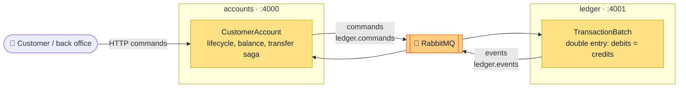

# Banking lab · Event Sourcing in Elixir


> 🧪 **This is a learning lab.** I built it to learn Event Sourcing, CQRS and DDD on a small
> core-banking domain: accounts, money transfers and a double-entry ledger.
> I'm sharing it as a **reference** for anyone walking the same path, and I'd love your
> **feedback** ([how to give it](#feedback)).

## The idea in one picture

Two bounded contexts, each one its own Phoenix service with its own event store. They share no code
and no database, and they talk only through RabbitMQ.



A transfer reserves money in `accounts`, is booked in the `ledger`, and is then confirmed or
compensated. There is no distributed transaction, only events and a saga.

## Where to go next

### 📐 The design: [`docs/event_storming.md`](docs/event_storming.md)

Start here to understand *why* the code looks the way it does.

| I want to… | Read |
| --- | --- |
| Learn the sticky-note colors | [1 · Legend](docs/event_storming.md#1-sticky-note-legend) |
| See an account's life at a glance | [2 · Big Picture](docs/event_storming.md#2-big-picture--timeline-of-the-pivotal-events) |
| Understand the account FSM | [3 · Account Management](docs/event_storming.md#3-process-level--account-management-context) |
| Understand the double-entry ledger | [4 · Ledger](docs/event_storming.md#4-process-level--ledger-context) |
| Follow a transfer end to end, including failures | [5 · TransferMoney flow](docs/event_storming.md#5-design-level--end-to-end-transfermoney-flow) |
| See how the two contexts relate | [6 · Context Map](docs/event_storming.md#6-context-map) |
| Browse every command, event and policy | [7 · Inventory](docs/event_storming.md#7-inventory-of-commands-events-and-aggregates) |
| See the open questions and how each was settled | [8 · Hotspots](docs/event_storming.md#8-hotspots--open-decisions) |
| Read the trade-offs (D1…D14) | [10 · Design decisions](docs/event_storming.md#10-design-decisions) |

### 🧩 The services

Each service has its own README with how it works inside.

| | [🏦 accounts](accounts/README.md) | [📒 ledger](ledger/README.md) |
| --- | --- | --- |
| Role | Account lifecycle, available balance, transfer saga | Immutable double-entry book, source of truth for balances |
| Tech stack | [Stack](accounts/README.md#tech-stack) | [Stack](ledger/README.md#tech-stack) |
| Run in dev | [Guide](accounts/README.md#run-in-dev) | [Guide](ledger/README.md#run-in-dev) |
| HTTP API + Swagger download | [API](accounts/README.md#http-api) | [API](ledger/README.md#http-api) |
| Aggregates | [CustomerAccount](accounts/README.md#aggregate) | [TransactionBatch · LedgerAccount](ledger/README.md#aggregates) |
| Commands | [13 commands](accounts/README.md#commands) | [3 commands](ledger/README.md#commands) |
| Events | [15 events](accounts/README.md#events) | [4 events](ledger/README.md#events) |
| Database tables | [Tables](accounts/README.md#database-tables) | [Tables](ledger/README.md#database-tables) |
| Queues | [Queues](accounts/README.md#queues) | [Queues](ledger/README.md#queues) |

## Quick start

```bash
docker compose up -d                 # Postgres, RabbitMQ and Swagger UI
(cd ledger && mix setup)             # the ledger first: its seeds open the PIX settlement account
(cd accounts && mix setup)
```

Then start each service with `iex -S mix phx.server` in its own terminal. Each service's
[run in dev](accounts/README.md#run-in-dev) guide has the details.

| Service | URL |
| --- | --- |
| 🏦 accounts API | http://localhost:4000/api |
| 📒 ledger API | http://localhost:4001/api |
| 📖 Swagger UI (both specs) | http://localhost:8080 |
| 🐇 RabbitMQ management | http://localhost:15672 (`banking` / `banking`) |

## Repository layout

```
.
├── docs/event_storming.md   # the design: event storming, context map, decisions D1…D14
├── accounts/                # Account Management Context (Phoenix service)
├── ledger/                  # Ledger Context (Phoenix service)
├── docker-compose.yml       # Postgres, RabbitMQ, Swagger UI
└── CLAUDE.md                # conventions for AI-assisted work on the repo
```

## Feedback

This is a study project, so questions and critiques are the point. 💬

- Something in the model looks wrong, or you would have decided a [trade-off](docs/event_storming.md#10-design-decisions) differently? Open an issue.
- A hotspot I missed? I'd love to hear about it.
- Found it useful? A ⭐ tells me it helped.
