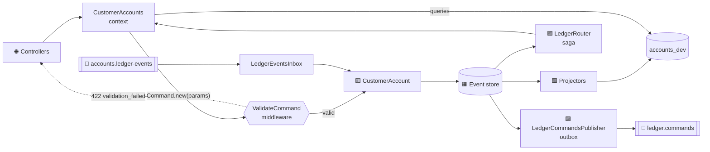
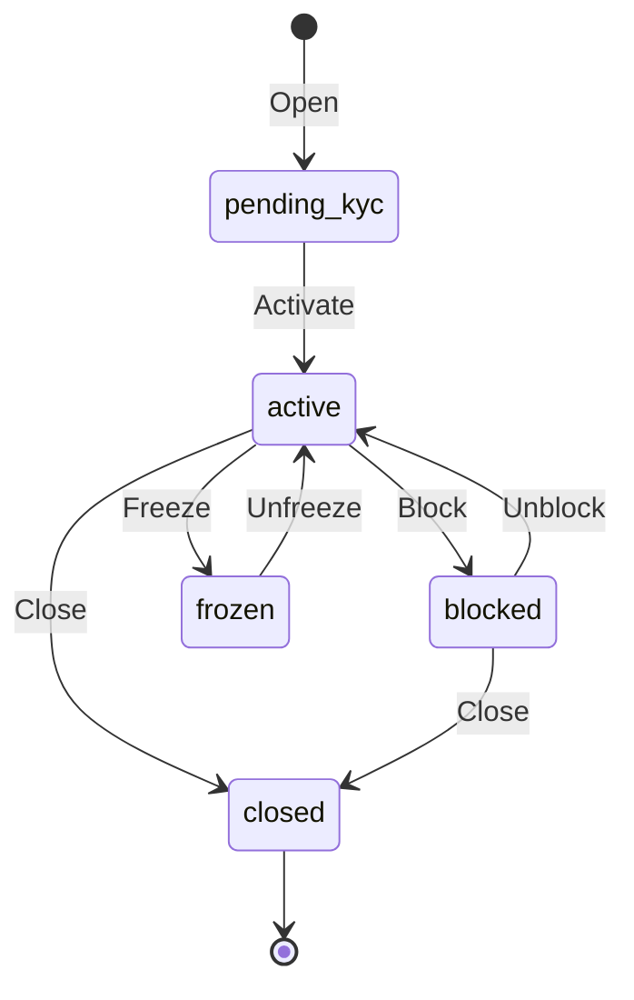
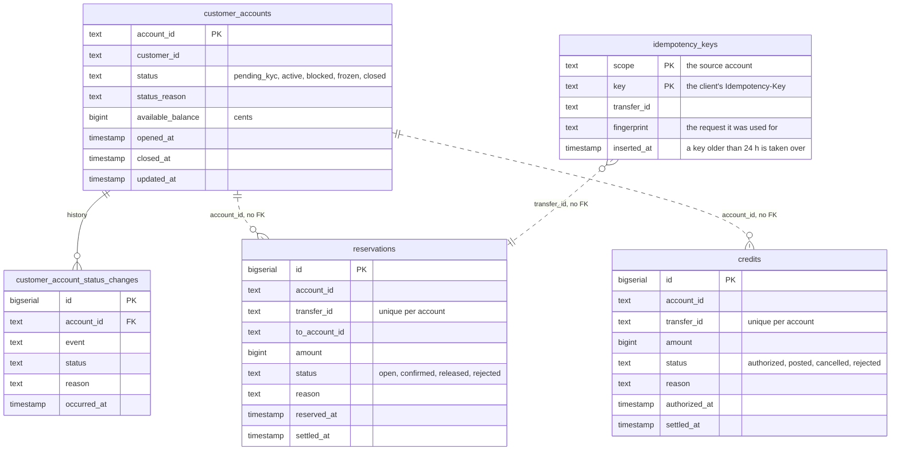
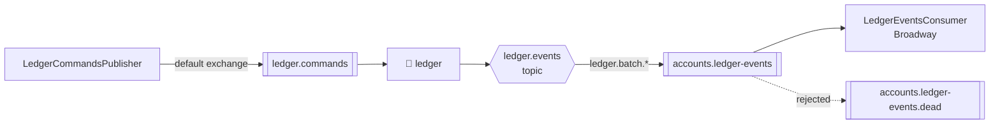

# 🏦 accounts · Account Management Context

The service that knows **who may move money**. It owns each customer account's lifecycle,
its available balance, and the transfer saga. The actual money book is the [📒 ledger](../ledger/README.md).

[← Back to the project](../../README.md) · [📐 Design doc](../../docs/event_storming.md)

| | |
| --- | --- |
| 🌐 HTTP | http://localhost:4000/api |
| 📖 Swagger | [⬇️ `priv/openapi.yaml`](priv/openapi.yaml?raw=true) · http://localhost:8080 |
| 🗄️ Databases | `accounts_eventstore_dev` (events) · `accounts_dev` (read models) · `*_prod` in prod mode |
| 🐇 Talks to | `ledger` through RabbitMQ only |

**Contents:** [How it works](#how-it-works) · [Tech stack](#tech-stack) · [Run in dev](#run-in-dev) ·
[HTTP API](#http-api) · [Aggregate](#aggregate) · [Commands](#commands) · [Events](#events) ·
[Database tables](#database-tables) · [Queues](#queues) · [Tests and quality](#tests-and-quality)

---

## How it works

Every write is a **command**, and the `CustomerAccount` aggregate turns it into **events** in the
event store. Everything else is a subscriber to those events.



- 🟨 **Aggregate:** holds the business rules (FSM, balance, credit matrix).
- 🟩 **Projectors:** build the read models the API queries (D11).
- 🟪 **Policies:** react to events. The saga authorizes and compensates, and the outbox sends
  commands to the Ledger (D3, D13).
- ✅ **Input rules** (a required field, a positive amount) live in each command and are checked
  before dispatch (D14).

## Tech stack

| | Library | Used for |
| --- | --- | --- |
| 💧 | Elixir 1.18 · Phoenix 1.7 · Bandit | JSON API |
| 🧠 | [Commanded](https://github.com/commanded/commanded) + [EventStore](https://github.com/commanded/eventstore) | CQRS/ES: aggregates, router, event handlers, Postgres event store |
| 🟩 | [commanded_ecto_projections](https://github.com/commanded/commanded-ecto-projections) · Ecto | Read models in Postgres |
| ✅ | [Vex](https://github.com/CargoSense/vex) · [ExConstructor](https://github.com/appcues/exconstructor) | Command input rules and building commands from params |
| 🐇 | [AMQP](https://github.com/pma/amqp) · [Broadway RabbitMQ](https://github.com/dashbitco/broadway_rabbitmq) | Publishing commands, consuming the Ledger's events |
| 📈 | [Phoenix LiveDashboard](https://github.com/phoenixframework/phoenix_live_dashboard) · [ecto_psql_extras](https://github.com/pawurb/ecto_psql_extras) | `/dashboard`: metrics during a load test, Postgres stats |
| 📜 | OpenAPI 3.1 · [JSV](https://github.com/lud/jsv) | Hand-written spec and contract tests |
| 🧪 | ExUnit · ExMachina · Mox · ExCoveralls | Tests |
| 🔍 | Credo · Dialyxir · Sobelow · mix_audit | `mix quality` |

## Run in dev

### 🐳 With Docker only

The service runs in dev mode in the dev container, and in prod mode from the root compose file
alone ([Switch modes](../../README.md#switch-modes)):

```bash
# From the repo root. 🛠️ Dev: mounted source, an edit reloads on the next request (`mix setup` first)
docker compose -f docker-compose.yml -f .devcontainer/compose.yaml up -d --wait
# 🚀 Prod: a release image built by Dockerfile, for the e2e stories and load tests (`bin/setup` first)
docker compose up -d --build --wait
docker compose logs -f accounts
```

In prod, [`Dockerfile`](Dockerfile) builds a `mix release` (no Elixir or source code in the
final image), and `Accounts.Release` ([`lib/accounts/release.ex`](lib/accounts/release.ex)) does
what `mix setup` does in dev, on the `*_prod` databases. It starts after the ledger is healthy,
since the ledger declares the queue this service sends commands to.

For `mix test`, `mix quality` and an `iex` shell, open the repo in the dev container (VS Code:
**Reopen in Container**) and run them from `apps/accounts`. Postgres and RabbitMQ are reached
by service name (`PGHOST`, `RABBITMQ_URL`).

### 💻 On the host

Needs Elixir 1.18 / OTP 25+. Docker runs only the infrastructure:

```bash
# 1. From the repo root: Postgres, RabbitMQ, Swagger UI
docker compose up -d postgres rabbitmq swagger-ui

# 2. The ledger first: its seeds open the bank's PIX settlement account, which deposits need
(cd apps/ledger && mix setup)

# 3. This service: deps, event store, read-model database
cd apps/accounts
mix setup

# 4. Run it (and `iex -S mix phx.server` in apps/ledger/, in another terminal)
iex -S mix phx.server
```

### 🚀 Try a transfer

```bash
# Open two accounts and activate them (pending_kyc → active)
A=$(curl -s localhost:4000/api/accounts -H 'content-type: application/json' \
      -d '{"customer_id":"alice"}' | jq -r .account_id)
B=$(curl -s localhost:4000/api/accounts -H 'content-type: application/json' \
      -d '{"customer_id":"bob"}' | jq -r .account_id)
curl -X POST localhost:4000/api/accounts/$A/activate
curl -X POST localhost:4000/api/accounts/$B/activate

# Money in: an inbound PIX of R$ 10.00 (amounts are cents, D1)
curl localhost:4000/api/accounts/$A/deposits -H 'content-type: application/json' \
  -H 'Idempotency-Key: dep-1' -d '{"amount":1000}'

# Transfer R$ 4.00 from A to B, then check the outcome. The key only answers a retry;
# the transfer has an id of its own (D17)
T=$(curl -s localhost:4000/api/transfers -H 'content-type: application/json' \
      -H 'Idempotency-Key: tr-1' -d "{\"from_account_id\":\"$A\",\"to_account_id\":\"$B\",\"amount\":400}" \
      | jq -r .transfer_id)
curl localhost:4000/api/transfers/$T       # pending → completed
```

💡 Freeze B (`POST /api/accounts/$B/freeze` with `{"reason":"fraud"}`) and transfer again.
The saga compensates and the transfer ends as `failed` with `credit_not_allowed`.

## Dashboard

📈 http://localhost:4000/dashboard (`banking` / `banking`), a
[LiveDashboard](https://github.com/phoenixframework/phoenix_live_dashboard) of this node. Watch it
during a load test ([how](../e2e/README.md#watch-it-on-the-dashboards)): the charts sample every
second, and keep only what they gathered while the page was open.

In prod, `DASHBOARD_USER` and `DASHBOARD_PASSWORD` set the credentials (`docker-compose.yml`
sets both). Without them, `/dashboard` is not served. Scripts load only with a per-request
nonce (Content-Security-Policy).

**Metrics** tab, one sub-tab per metric prefix ([`lib/accounts_web/telemetry.ex`](lib/accounts_web/telemetry.ex)):

| Tab | Chart | Shows |
| --- | --- | --- |
| **Accounts** | `repo.query.queue_time` | ⏳ waiting for a read-model connection: it grows once the pool is too small |
| | `repo.query.query_time` | 🐘 how long Postgres takes |
| | `subscription.lag.events` | 🐢 events stored that each subscription has yet to handle: the three projectors, the saga (`ledger_router`) and the outbox (`ledger_commands_publisher`) |
| | `queue.messages` · `queue.consumers` | 🐇 messages ready in `accounts.ledger-events` and `accounts.ledger-events.dead` |
| | `error.count` | 💥 errors logged, by exception (`DBConnection.ConnectionError`, …) or by the module that logged them |
| **VM** | `scheduler_utilization.total` | 🔥 how busy the schedulers are, in %. The BEAM starts one per CPU of the quota, so 100 means the quota is used up |
| | `total_run_queue_lengths` | processes waiting for a scheduler |
| | `memory` | total, processes, binaries |
| **Commanded** | `application.dispatch` · `event.handle` | a command until its events are stored; each handler per event |
| **Broadway** | `processor.message` | one message from the Ledger's events queue |
| **Phoenix** | `router_dispatch` | request time by route, and requests that raised |

`AccountsWeb.Telemetry.Sampler` measures what no telemetry event reports: the schedulers, the lag
(from the event store's `subscriptions` table) and the queues (a passive declare per queue, on
a connection of its own). `AccountsWeb.Telemetry.ErrorCounter` is a `:logger` handler.

**Ecto Stats** shows the read-model database: connections, locks, the queries running for over
200 ms, cache hits.

## HTTP API

The contract is [`priv/openapi.yaml`](priv/openapi.yaml), written by hand and the source of truth
(D12). **[⬇️ Download it](priv/openapi.yaml?raw=true)** to import into Postman or Insomnia, or
browse it in Swagger UI at http://localhost:8080 once `docker compose up -d` is running.

| | Method · path | What it does |
| --- | --- | --- |
| 🆕 | `POST /api/accounts` | Open an account (starts `pending_kyc`) |
| 🔎 | `GET /api/accounts?customer_id=` · `GET /api/accounts/{id}` | Status and available balance |
| 📜 | `GET /api/accounts/{id}/status-history` | Every FSM transition |
| 🔁 | `POST /api/accounts/{id}/activate · block · unblock · freeze · unfreeze · close` | Lifecycle, `204` |
| 💸 | `POST /api/transfers` | Start a transfer (`202` with its `transfer_id`; a retry with the same `Idempotency-Key` gets the same one, D17) |
| 🔎 | `GET /api/transfers/{transfer_id}` | `pending` · `completed` · `failed` |
| 📥 | `POST /api/accounts/{id}/deposits` | Receive an inbound PIX |
| 📋 | `GET /api/accounts/{id}/reservations` · `/credits` | Paginated history of money out and in |

Errors look like `{"errors": {"code": "insufficient_balance", "detail": "…"}}`.

| Status | Codes |
| --- | --- |
| `404` | `not_found`, `account_not_found` |
| `409` | `invalid_transition`, `balance_not_zero`, `open_reservations`, `pending_credits` |
| `422` | `validation_failed` (with `fields`), `invalid_query`, `account_not_active`, `insufficient_balance`, `credit_not_allowed` |

## Aggregate

### 🟨 `CustomerAccount`

[`lib/accounts/aggregates/customer_account.ex`](lib/accounts/aggregates/customer_account.ex): one stream per
`account_id`. All of its rules live in this one file.



| Status | 💸 Send (debit) | 📥 Receive (credit) |
| --- | :---: | :---: |
| `pending_kyc` | ❌ | ❌ |
| `active` | ✅ | ✅ |
| `blocked` | ❌ | ✅ |
| `frozen` | ❌ | ❌ |
| `closed` | ❌ | ❌ |

**State it keeps:** `status`, `available_balance`, open `reservations` and `pending_credits`,
plus every `transfer_id` already decided or posted, so a redelivered message changes nothing
(D4).

**Its business rules:**

- A transition not in the diagram → `invalid_transition`.
- Closing needs an empty account → `balance_not_zero`, `open_reservations`, `pending_credits` (D8).
- Reserving needs `active` and enough balance. Otherwise a `BalanceReservationRejected` event is
  recorded.
- Authorizing a credit needs `active` or `blocked`. Otherwise a `CreditRejected` event is
  recorded.
- Once a transfer is in flight, freezing doesn't stop it: confirm, release, post and cancel
  ignore the status (D7).

♻️ **Lifespan:** the account's process leaves memory after 5 minutes without a command, longer
than the gap between a transfer's steps. The next command rebuilds it from its stream, which
grows with every transfer. The `transfer_id` sets above grow with it and stay in memory while
the process lives.

## Commands

Each one is declared with `use Accounts.Command, fields: [...]` plus Vex `validates`
([`lib/accounts/commands/`](lib/accounts/commands/)). ✅ marks the input rules checked before
dispatch.

| Command | Fields | ✅ Input rules | Sent by |
| --- | --- | --- | --- |
| `OpenCustomerAccount` | `account_id`, `customer_id` | both present | 🌐 API |
| `ActivateCustomerAccount` | `account_id` | present | 🌐 API (KYC back office) |
| `BlockCustomerAccount` | `account_id`, `reason` | both present | 🌐 API |
| `UnblockCustomerAccount` | `account_id` | present | 🌐 API |
| `FreezeCustomerAccount` | `account_id`, `reason` | both present | 🌐 API |
| `UnfreezeCustomerAccount` | `account_id` | present | 🌐 API |
| `CloseCustomerAccount` | `account_id` | present | 🌐 API |
| `ReserveBalance` | `account_id`, `amount`, `transfer_id`, `to_account_id` | positive cents, destination ≠ source | 🌐 API (transfer) |
| `AuthorizeCredit` | `account_id`, `amount`, `transfer_id`, `from_account_id` | positive cents | 🟪 saga · 🌐 API (deposit) |
| `ConfirmReservation` | `account_id`, `transfer_id` | present | 🐇 Ledger booked |
| `ReleaseBalance` | `account_id`, `transfer_id` | present | 🟪 saga · 🐇 Ledger rejected |
| `PostCredit` | `account_id`, `amount`, `transfer_id` | positive cents | 🐇 Ledger booked |
| `CancelCredit` | `account_id`, `transfer_id` | present | 🐇 Ledger rejected |

## Events

[`lib/accounts/events/`](lib/accounts/events/). Timestamps come from the event store's metadata,
not from the payload.

| | Event | Payload | Emitted when |
| --- | --- | --- | --- |
| 🔁 | `CustomerAccountOpened` | `account_id`, `customer_id` | an account is opened |
| 🔁 | `CustomerAccountActivated` | `account_id` | KYC approved |
| 🔁 | `CustomerAccountBlocked` | `account_id`, `reason` | blocked by the back office |
| 🔁 | `CustomerAccountUnblocked` | `account_id` | unblocked |
| 🔁 | `CustomerAccountFrozen` | `account_id`, `reason` | frozen |
| 🔁 | `CustomerAccountUnfrozen` | `account_id` | unfrozen |
| 🔁 | `CustomerAccountClosed` | `account_id` | closed, empty |
| 💸 | `BalanceReserved` | `account_id`, `amount`, `transfer_id`, `to_account_id` | a transfer holds the money |
| ❌ | `BalanceReservationRejected` | … + `reason` | not active or not enough balance |
| ✅ | `ReservationConfirmed` | `account_id`, `transfer_id`, `amount` | the Ledger booked the batch |
| ↩️ | `BalanceReleased` | `account_id`, `transfer_id`, `amount` | compensation: the money is back |
| 📥 | `CreditAuthorized` | `account_id`, `amount`, `transfer_id`, `from_account_id` | the destination accepts the credit |
| ❌ | `CreditRejected` | … + `reason` | the destination can't receive |
| ✅ | `CreditPosted` | `account_id`, `amount`, `transfer_id` | the Ledger booked it, balance goes up |
| ↩️ | `CreditCancelled` | `account_id`, `transfer_id`, `amount` | the Ledger rejected the batch |

### 🟪 Who reacts to them

| Handler | On | Does |
| --- | --- | --- |
| `LedgerRouter` (saga, D13) | `BalanceReserved` | `AuthorizeCredit` on the destination |
| | `CreditRejected` | `ReleaseBalance` on the source |
| `LedgerCommandsPublisher` (outbox, D3) | `CustomerAccountOpened` / `Closed` | sends `OpenLedgerAccount` / `CloseLedgerAccount` |
| | `CreditAuthorized` | sends `BookTransactionBatch` (debit source, credit destination) |
| `LedgerEventsInbox` (RabbitMQ) | `LedgerBatchBooked` | `ConfirmReservation` + `PostCredit` |
| | `LedgerBatchRejected` | `ReleaseBalance` + `CancelCredit` |

## Database tables

**Event store** (`accounts_eventstore_dev`) is managed by EventStore: one stream per account.
**Read models** (`accounts_dev`) have one owning projector per table, and can be rebuilt with
`mix commanded.reset` (D11).



| Table | 🟩 Projector | Serves |
| --- | --- | --- |
| `customer_accounts` + `customer_account_status_changes` | `CustomerAccountsProjector` | account status, balance, history |
| `reservations` | `ReservationsProjector` | money out, transfer outcome |
| `credits` | `CreditsProjector` | money in, pending credits (D8) |
| `projection_versions` | (the library) | last event each projector has applied |
| `idempotency_keys` | none: the API's edge writes it (D17) | a retry's `Idempotency-Key` → its `transfer_id` |

## Queues



| Queue / exchange | Owner | Direction | Carries |
| --- | --- | --- | --- |
| `ledger.commands` | 📒 ledger | ➡️ out | `OpenLedgerAccount`, `CloseLedgerAccount`, `BookTransactionBatch` |
| `ledger.events` (topic) | 📒 ledger | ⬅️ in | `ledger.batch.booked`, `ledger.batch.rejected` |
| `accounts.ledger-events` | 🏦 accounts | ⬅️ in | this service's subscription to `ledger.batch.*` |
| `accounts.ledger-events.dead` | 🏦 accounts | 💀 | messages that failed, to inspect and replay |

Delivery is at least once, so every consumer deduplicates by `transfer_id` (D4). Publishing
uses publisher confirms plus `mandatory`, so a message is never lost silently (D10).

🧵 **Lineage** (D17): a message carries its conversation's `correlation_id` as an AMQP property
and the id of the event it came from as its `message_id`, never in the body. The consumer
dispatches with both, so one transfer shows a single `correlation_id` in both event stores, each
event caused by the one before it (`causation_id`). Logs are tagged with it too.

## Tests and quality

```bash
mix test        # creates and migrates the test databases on its own
mix quality     # format, warnings as errors, credo --strict, sobelow, deps.audit, dialyzer
```

| Layer | Tests |
| --- | --- |
| Aggregate | pure `execute/2` and `apply/2`, no database |
| Projectors | called directly, against the database (`DataCase`) |
| Controllers | each response validated against `priv/openapi.yaml` (`assert_response_schema`) |
| API contract | the router serves exactly the spec's operations |
