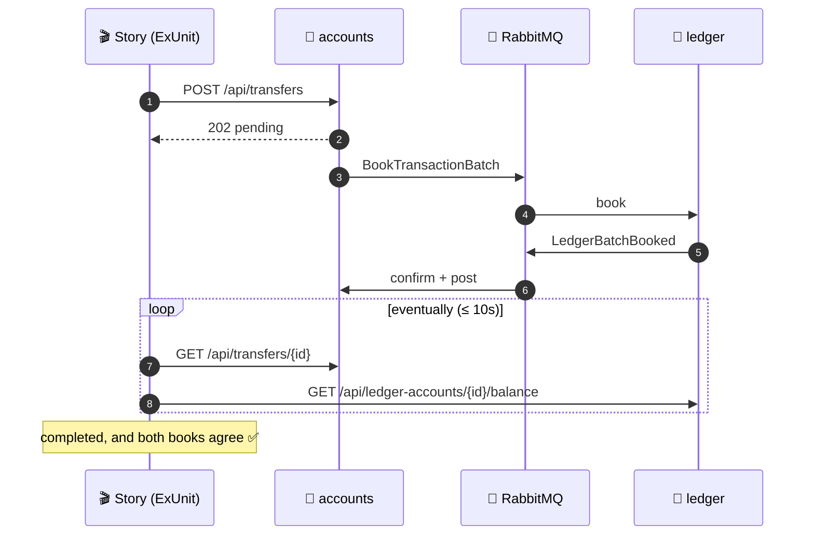

# 🎬 e2e · Story tests across both services

Unit tests prove each rule, but they can't prove the whole story. Here the story is a deposit
crossing RabbitMQ twice, a saga compensating, and both books agreeing at the end. This suite
drives the **running** services from the outside, the way a client would, and checks where the
system ends up (D15).

[← Back to the project](../../README.md) · [📐 Design doc](../../docs/event_storming.md#d15--story-tests-drive-the-running-services-from-outside)

| | |
| --- | --- |
| 🧰 Stack | ExUnit · [Req](https://github.com/wojtekmach/req) (HTTP) · [AMQP](https://github.com/pma/amqp) (replaying messages) |
| 🔌 Talks to | the Accounts and Ledger HTTP APIs and RabbitMQ. It shares no code with either service |
| ⏱️ Runtime | a few seconds; the stories run concurrently |

**Contents:** [How a story works](#how-a-story-works) · [Run it](#run-it) · [Stories](#stories) ·
[Replay them in Postman](#replay-them-in-postman) · [Writing a story](#writing-a-story)

---

## How a story works



- ⏳ **`eventually/1`**: reads come from read models (D11), so a story says *where* the system
  must end up, not *when*. It retries the assertions for up to 10s and then raises the last
  failure.
- ⚖️ **`assert_balance/2`**: checks the same amount in both books, the available balance in
  Accounts and the ledger balance in the Ledger (D2).
- 🧍 **Isolation**: each story opens its own accounts with fresh keys, so stories run
  concurrently against a shared dev database.
- 🧷 **Sentinel**: both consumers handle one message at a time, in order (D10). To prove a replayed
  message was handled, a story sends a small deposit after it and waits for it to land.

## Run it

> 🐳 Needs the whole stack running. A devcontainer is planned to do this in one step.

```bash
# From the repo root
docker compose up -d
(cd apps/ledger && mix setup)       # first time only: its seeds open the PIX settlement account
(cd apps/accounts && mix setup)     # first time only

# Two terminals
(cd apps/ledger && iex -S mix phx.server)
(cd apps/accounts && iex -S mix phx.server)

# Then
cd apps/e2e
mix deps.get
mix test
```

If a service is down, `test_helper.exs` stops right away and tells you what to start.
Point the suite elsewhere with `ACCOUNTS_URL`, `LEDGER_URL` and `RABBITMQ_URL`.

## Stories

| File | Story | Crosses |
| --- | --- | --- |
| [`account_lifecycle_test`](test/stories/account_lifecycle_test.exs) | 🆕 opening an account opens its ledger account | Accounts → 🐇 → Ledger |
| | 🔒 an account with money can't close until it is emptied | full saga + close + ledger close |
| | 🚫 a transition the FSM doesn't allow is refused | Accounts |
| [`deposit_test`](test/stories/deposit_test.exs) | 📥 an inbound PIX lands in both books | Accounts → 🐇 → Ledger → 🐇 → Accounts |
| | 🔁 a repeated `Idempotency-Key` credits once | same, plus a sentinel |
| | 🧊 a frozen account refuses a PIX | Accounts |
| [`transfer_test`](test/stories/transfer_test.exs) | 💸 a transfer moves money, in both books | full saga, batch entries |
| | 🟠 a blocked account still receives | credit matrix through the saga |
| | ↩️ a frozen destination: the saga gives the money back | compensation |
| | ❌ above the available balance: refused at once | Accounts |
| | 🟠 a blocked account cannot send | Accounts |
| | 🔁 a repeated `Idempotency-Key` starts no second transfer | full saga |
| | ✅ an invalid transfer never reaches an account | input rules (D14) |
| [`redelivery_test`](test/stories/redelivery_test.exs) | 📨 a redelivered `BookTransactionBatch` books nothing twice | replayed on `ledger.commands` |
| | 📨 a redelivered `LedgerBatchBooked` settles nothing twice | replayed on `ledger.events` |
| | 📨 a late `LedgerBatchRejected` for a booked batch gives nothing back | replayed on `ledger.events` |
| [`books_balance_test`](test/stories/books_balance_test.exs) | ⚖️ total debits equal total credits | Ledger trial balance |

## Replay them in Postman

Want to see it with your own eyes? [`postman/`](postman/) mirrors every story above, one folder
per test with the same requests and assertions, so you can double-check by hand.

| File | What it is |
| --- | --- |
| [⬇️ `banking.postman_collection.json`](postman/banking.postman_collection.json?raw=true) | the 17 stories, grouped by test file |
| [⬇️ `local.postman_environment.json`](postman/local.postman_environment.json?raw=true) | URLs and RabbitMQ credentials for the local stack |

1. In Postman, **Import** both files and select the `local` environment.
2. Open a story folder and click **Run** (Collection Runner).
3. Watch each step: ids and keys chain from one request to the next, and the `Wait until …`
   steps repeat themselves until they pass, for up to 10 s.

The replay stories publish through the RabbitMQ management API (`:15672`), so they run in
Postman too. The `Wait until …` steps repeat only in the Runner. Sent one at a time, a step
that isn't ready yet just shows no result, so send it again.

From the terminal, the same collection runs with Newman:

```bash
npx newman run apps/e2e/postman/banking.postman_collection.json \
  -e apps/e2e/postman/local.postman_environment.json
```

> 🧭 The ExUnit stories are the source of truth. The collection is a mirror: a change to a story
> updates its folder in the same commit, never the other way around.

## Writing a story

```elixir
defmodule E2E.Stories.MyStoryTest do
  use E2E.StoryCase, async: true

  test "what the customer sees happen" do
    from = funded_account(1_000)          # open + activate + PIX, waits until it lands
    to = active_account()
    key = new_key("transfer")

    assert %{status: 202} = Accounts.transfer(from, to, 400, key)

    settled_transfer(key, "completed")    # eventually, through the saga
    eventually(fn -> assert_balance(from, 600) end)
  end
end
```

- Tell a story a customer or operator would recognize, across at least one boundary. An edge case
  of one rule belongs in the service's unit tests, where it costs a millisecond.
- Use only the public API and the RabbitMQ contract. Don't read the services' databases.
- Wrap every read that follows a command in `eventually`.
- Mirror it in [`postman/`](postman/) in the same commit: a folder with the test's name and the
  same steps. Then run both `mix test` and Newman.
