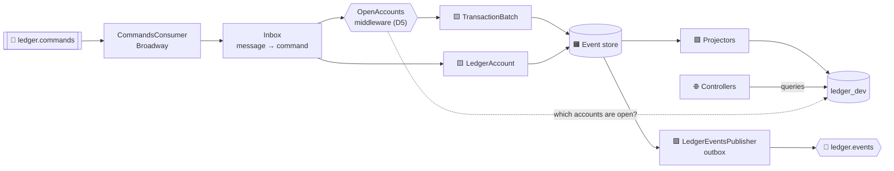
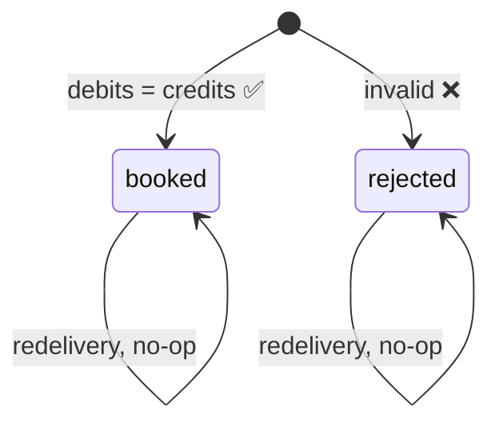
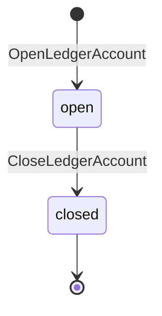
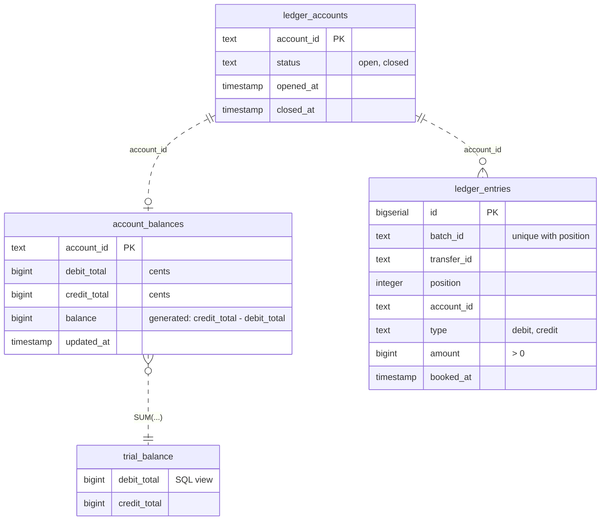
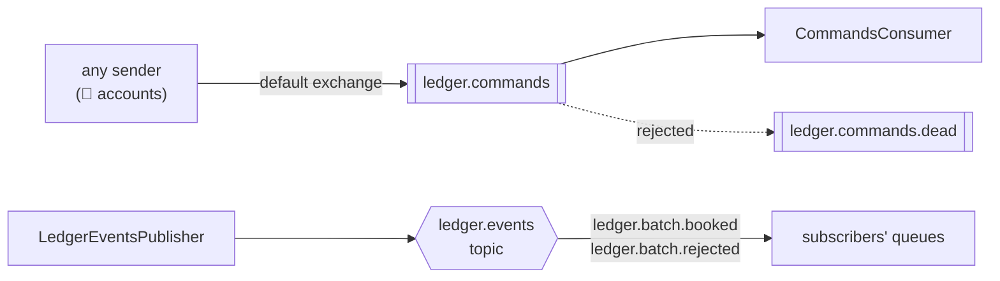

# 📒 ledger · Ledger Context

The bank's **immutable double-entry book**. Every movement is a batch of entries in which
**debits = credits**. Nothing is ever edited. It is the source of truth for balances, and it knows
no other context: it takes commands and publishes its own events.

[← Back to the project](../../README.md) · [📐 Design doc](../../docs/event_storming.md)

| | |
| --- | --- |
| 🌐 HTTP (read-only) | http://localhost:4001/api |
| 📖 Swagger | [⬇️ `priv/openapi.yaml`](priv/openapi.yaml?raw=true) · http://localhost:8080 |
| 🗄️ Databases | `ledger_eventstore_dev` (events) · `ledger_dev` (read models) · `*_prod` in prod mode |
| 🐇 Talks to | whoever sends to `ledger.commands` and listens on `ledger.events` |

**Contents:** [How it works](#how-it-works) · [Tech stack](#tech-stack) · [Run in dev](#run-in-dev) ·
[HTTP API](#http-api) · [Aggregates](#aggregates) · [Commands](#commands) · [Events](#events) ·
[Database tables](#database-tables) · [Queues](#queues) · [Tests and quality](#tests-and-quality)

---

## How it works

Commands arrive **only through RabbitMQ**. HTTP is read-only, so nothing can book around the
Accounts rules (D12).



- 🟨 **Aggregates:** `TransactionBatch` checks the double-entry invariant, and `LedgerAccount`
  opens and closes accounts.
- 🛡️ **The D5 check:** before a batch reaches its aggregate, the middleware marks any account in
  it that is not open, and the batch is rejected.
- 🟪 **Outbox:** booked and rejected batches go out on the `ledger.events` exchange (D3, D13).

## Tech stack

| | Library | Used for |
| --- | --- | --- |
| 💧 | Elixir 1.18 · Phoenix 1.7 · Bandit | Read-only JSON API |
| 🧠 | [Commanded](https://github.com/commanded/commanded) + [EventStore](https://github.com/commanded/eventstore) | CQRS/ES: aggregates, router, middleware, event handlers, Postgres event store |
| 🟩 | [commanded_ecto_projections](https://github.com/commanded/commanded-ecto-projections) · Ecto | Read models, plus a SQL view for the trial balance |
| 🐇 | [Broadway RabbitMQ](https://github.com/dashbitco/broadway_rabbitmq) · AMQP | Consuming commands, publishing events |
| 📈 | [Phoenix LiveDashboard](https://github.com/phoenixframework/phoenix_live_dashboard) · [ecto_psql_extras](https://github.com/pawurb/ecto_psql_extras) | `/dashboard`: metrics during a load test, Postgres stats |
| 📜 | OpenAPI 3.1 · [JSV](https://github.com/lud/jsv) | Hand-written spec and contract tests |
| 🧪 | ExUnit · ExMachina · Mox · ExCoveralls | Tests |
| 🔍 | Credo · Dialyxir · Sobelow · mix_audit | `mix quality` |

## Run in dev

### 🐳 With Docker only

The service runs in dev mode in the dev container, and in prod mode from the root compose file
alone ([Switch modes](../../README.md#switch-modes)):

```bash
# From the repo root. 🛠️ Dev: mounted source, an edit reloads on the next request (`mix setup` first)
docker compose -f docker-compose.yml -f .devcontainer/compose.yaml up -d --wait
# 🚀 Prod: a release image built by Dockerfile, for the e2e stories and load tests (`bin/setup` first)
docker compose up -d --build --wait
docker compose logs -f ledger
```

In prod, [`Dockerfile`](Dockerfile) builds a `mix release` (no Elixir or source code in the
final image), and `Ledger.Release` ([`lib/ledger/release.ex`](lib/ledger/release.ex)) does what
`mix setup` does in dev, on the `*_prod` databases. Its setup runs on every start. It is
idempotent, seeds included.

For `mix test`, `mix quality` and an `iex` shell, open the repo in the dev container (VS Code:
**Reopen in Container**) and run them from `apps/ledger`. Postgres and RabbitMQ are reached by
service name (`PGHOST`, `RABBITMQ_URL`).

### 💻 On the host

Needs Elixir 1.18 / OTP 25+. Docker runs only the infrastructure:

```bash
# 1. From the repo root: Postgres, RabbitMQ, Swagger UI
docker compose up -d postgres rabbitmq swagger-ui

# 2. Deps, event store, read-model database and seeds
cd apps/ledger
mix setup

# 3. Run it on :4001
iex -S mix phx.server
```

🌱 **Seeds** open the bank's own `pix-settlement` account. Every inbound PIX debits it, so its
balance goes negative as customers receive money (D2, D13).

To see money move, run [🏦 accounts](../accounts/README.md#run-in-dev) too and follow its
*Try a transfer* steps. Then check the ledger:

```bash
curl localhost:4001/api/ledger-accounts/pix-settlement/balance
curl localhost:4001/api/trial-balance        # debit_total == credit_total, always ⚖️
```

## Dashboard

📈 http://localhost:4001/dashboard (`banking` / `banking`), a
[LiveDashboard](https://github.com/phoenixframework/phoenix_live_dashboard) of this node. Watch it
during a load test ([how](../e2e/README.md#watch-it-on-the-dashboards)): the charts sample every
second, and keep only what they gathered while the page was open.

In prod, `DASHBOARD_USER` and `DASHBOARD_PASSWORD` set the credentials (`docker-compose.yml`
sets both). Without them, `/dashboard` is not served. Scripts load only with a per-request
nonce (Content-Security-Policy).

**Metrics** tab, one sub-tab per metric prefix ([`lib/ledger_web/telemetry.ex`](lib/ledger_web/telemetry.ex)):

| Tab | Chart | Shows |
| --- | --- | --- |
| **Ledger** | `repo.query.queue_time` | ⏳ waiting for a read-model connection: it grows once the pool is too small |
| | `repo.query.query_time` | 🐘 how long Postgres takes |
| | `subscription.lag.events` | 🐢 events stored that each subscription has yet to handle: the three projectors and the outbox (`ledger_events_publisher`) |
| | `queue.messages` · `queue.consumers` | 🐇 messages ready in `ledger.commands` and `ledger.commands.dead` |
| | `error.count` | 💥 errors logged, by exception (`DBConnection.ConnectionError`, …) or by the module that logged them |
| **VM** | `scheduler_utilization.total` | 🔥 how busy the schedulers are, in %. The BEAM starts one per CPU of the quota, so 100 means the quota is used up |
| | `total_run_queue_lengths` | processes waiting for a scheduler |
| | `memory` | total, processes, binaries |
| **Commanded** | `application.dispatch` · `event.handle` | a command until its events are stored; each handler per event |
| **Broadway** | `processor.message` | one message from the commands queue |
| **Phoenix** | `router_dispatch` | request time by route, and requests that raised |

`LedgerWeb.Telemetry.Sampler` measures what no telemetry event reports: the schedulers, the lag
(from the event store's `subscriptions` table) and the queues (a passive declare per queue, on
a connection of its own). `LedgerWeb.Telemetry.ErrorCounter` is a `:logger` handler.

**Ecto Stats** shows the read-model database: connections, locks, the queries running for over
200 ms, cache hits.

## HTTP API

The contract is [`priv/openapi.yaml`](priv/openapi.yaml), written by hand and the source of truth
(D12). **[⬇️ Download it](priv/openapi.yaml?raw=true)** to import into Postman or Insomnia, or
browse it in Swagger UI at http://localhost:8080 once `docker compose up -d` is running.

| | Method · path | What it does |
| --- | --- | --- |
| 🔎 | `GET /api/ledger-accounts/{id}` | `open` or `closed` |
| 💰 | `GET /api/ledger-accounts/{id}/balance` | debit total, credit total, balance |
| 📜 | `GET /api/ledger-accounts/{id}/entries?from=&to=&limit=&after=` | Statement, newest first, paginated |
| 🧾 | `GET /api/batches?transfer_id=` | The booked batches that settle a transfer (D17) |
| 📦 | `GET /api/batches/{batch_id}` | A booked batch and its entries |
| ⚖️ | `GET /api/trial-balance` | Sum of every debit and every credit |

Errors: `404 not_found`, and `422 invalid_query` for a bad filter or cursor.

## Aggregates

### 🟨 `TransactionBatch`

[`lib/ledger/aggregates/transaction_batch.ex`](lib/ledger/aggregates/transaction_batch.ex): one stream per `batch_id`,
derived from the transfer's `transfer_id` (`UUIDv5`, D17). So a redelivered command finds the batch already
decided and books nothing (D4).



**The invariant:** `sum(debits) - sum(credits) = 0`. A batch that breaks a rule is not an error:
it becomes a `LedgerBatchRejected` event, so the sender hears back and compensates (D14).

| Rejection `reason` | When |
| --- | --- |
| `empty` | the batch has no entries |
| `invalid_amount` | an amount is not a positive integer number of cents (D1) |
| `invalid_entry_type` | an entry is neither `debit` nor `credit` |
| `unbalanced` | debits ≠ credits |
| `account_not_open` | an entry touches an account that is not open (D5) |

♻️ **Lifespan:** the batch's process stops as soon as its command is handled (booked,
rejected, a redelivery or an error), through the aggregate's `AggregateLifespan` callbacks set in
the router. Every transfer and deposit makes a new batch, so one kept alive would hold memory
forever. A later command rebuilds the batch from its one event.

### 🟨 `LedgerAccount`

[`lib/ledger/aggregates/ledger_account.ex`](lib/ledger/aggregates/ledger_account.ex): the chart of accounts, one
stream per `account_id`. The lifecycle is deliberately minimal, because the business rules live in
Accounts (D5).



Opening an account that exists, or closing one already closed, does nothing (D4). Closing an
account that never existed fails with `account_not_found`.

♻️ **Lifespan:** the account's process leaves memory after 5 minutes without a command, and the
next command rebuilds it from its stream.

## Commands

Commands arrive as JSON on `ledger.commands`, with the `type` and the `correlation_id` as AMQP
properties. The
[`Inbox`](lib/ledger/messaging/inbox.ex) turns each one into a struct.

| Command | Fields | Aggregate |
| --- | --- | --- |
| `OpenLedgerAccount` | `account_id` | `LedgerAccount` |
| `CloseLedgerAccount` | `account_id` | `LedgerAccount` |
| `BookTransactionBatch` | `batch_id`, `transfer_id`, `entries: [{account_id, type, amount}]` | `TransactionBatch` |

Open and close are dispatched with strong consistency, so the next batch on the queue already
sees the account. `BookTransactionBatch` also has an internal `accounts_not_open` field, which
the middleware fills and no sender sets.

## Events

[`lib/ledger/events/`](lib/ledger/events/)

| | Event | Payload | Published on `ledger.events`? |
| --- | --- | --- | --- |
| 🟢 | `LedgerAccountOpened` | `account_id` | — internal |
| 🔴 | `LedgerAccountClosed` | `account_id` | — internal |
| ✅ | `LedgerBatchBooked` | `batch_id`, `transfer_id`, `entries` | 📣 `ledger.batch.booked` |
| ❌ | `LedgerBatchRejected` | `batch_id`, `transfer_id`, `reason`, `entries` | 📣 `ledger.batch.rejected` |

A rejection carries its entries, so a subscriber knows whom to compensate without keeping
state (D13).

## Database tables

**Event store** (`ledger_eventstore_dev`) is managed by EventStore. **Read models**
(`ledger_dev`) have one owning projector per table, and can be rebuilt with
`mix commanded.reset` (D11).

🏗️ **When a projector fails** (`Ledger.Handlers.ProjectorFailures`, D18): an error of the database
(pool, connection, timeout, deadlock) is retried with a delay from 100 ms up to 30 s, for as long
as it takes, and shows as the subscription's lag. Any other error is a bug: the projector stops,
and past its restarts the service with it.



| Table | 🟩 Projector | Serves |
| --- | --- | --- |
| `ledger_accounts` | `LedgerAccountsProjector` (strong consistency) | account status, the D5 check |
| `account_balances` | `BalancesProjector` | balance per account |
| `ledger_entries` | `StatementProjector` | statement, batches |
| `trial_balance` | — a SQL view over `account_balances` | proof of double entry |
| `projection_versions` | (the library) | last event each projector has applied |

💡 `account_balances` keeps both totals, and `balance` is a generated column, so no sign
convention per kind of account is needed. The PIX account goes negative and customer accounts
positive.

## Queues

The Ledger **owns** both ends: it declares the command queue and the event exchange. Subscribers
bind queues of their own (D10).



| Queue / exchange | Type | Carries |
| --- | --- | --- |
| `ledger.commands` | queue, single consumer, so messages stay in order | `OpenLedgerAccount`, `CloseLedgerAccount`, `BookTransactionBatch` |
| `ledger.commands.dead` | dead-letter queue | unknown, malformed or refused commands, to inspect and replay |
| `ledger.events` | topic exchange | `ledger.batch.booked`, `ledger.batch.rejected` |

Publishing uses publisher confirms plus `mandatory`: a message that no queue takes fails and is
retried by the outbox, never dropped silently.

🧵 **Lineage** (D17): a message carries its conversation's `correlation_id` as an AMQP property
and the id of the event it came from as its `message_id`, never in the body. The consumer
dispatches with both, so one transfer shows a single `correlation_id` in both event stores, each
event caused by the one before it (`causation_id`). Logs are tagged with it too.

## Tests and quality

```bash
mix test        # creates and migrates the test databases on its own
mix quality     # format, warnings as errors, credo --strict, sobelow, deps.audit, dialyzer
```

| Layer | Tests |
| --- | --- |
| Aggregates | pure `execute/2` and `apply/2`, including every rejection reason |
| Projectors | called directly, against the database (`DataCase`) |
| Messaging | the inbox and the publisher, with a Mox publisher |
| Controllers | each response validated against `priv/openapi.yaml` (`assert_response_schema`) |
| API contract | the router serves exactly the spec's operations |
