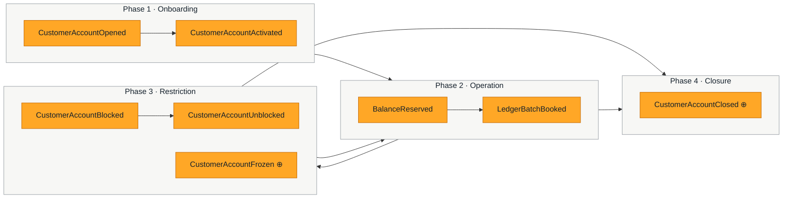
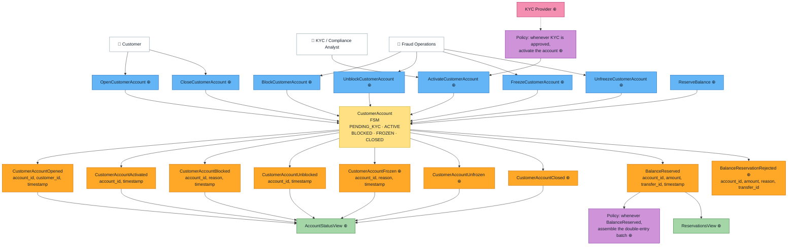
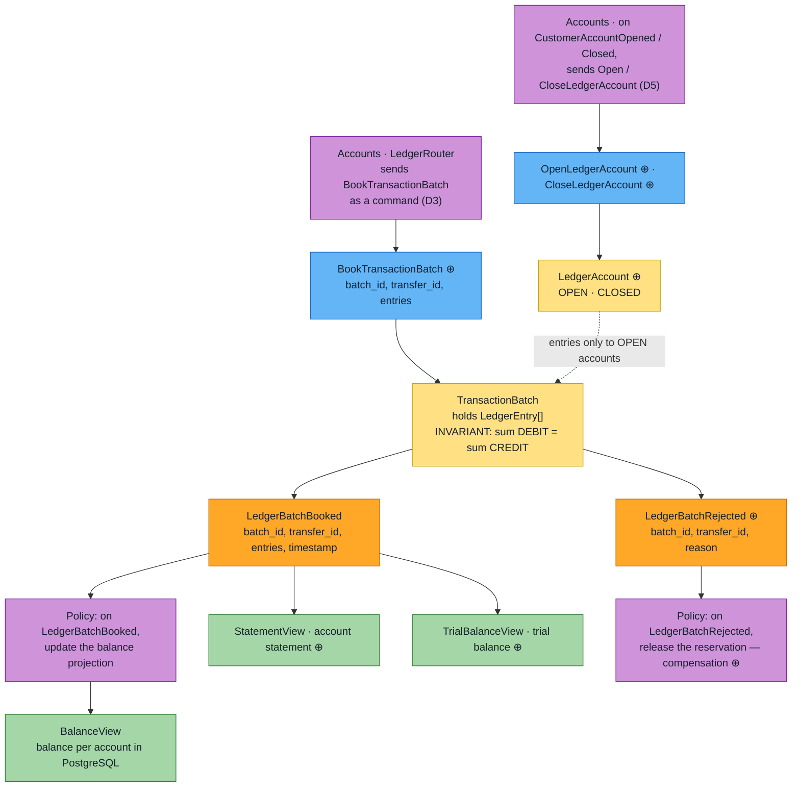
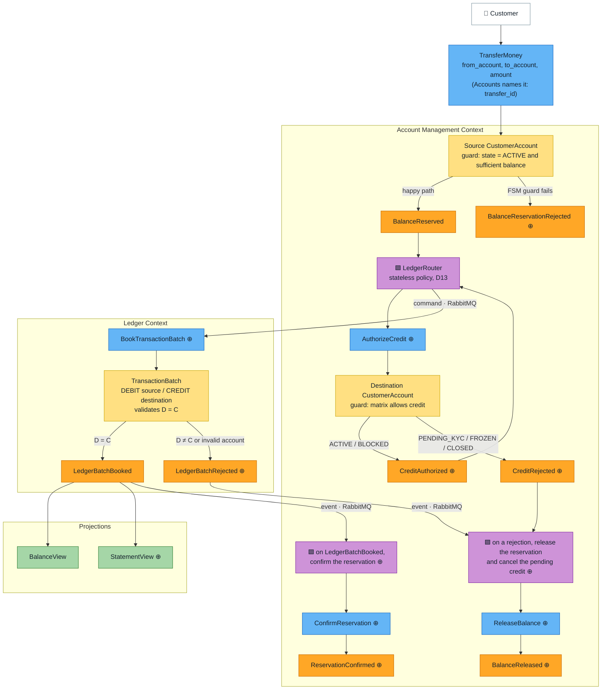
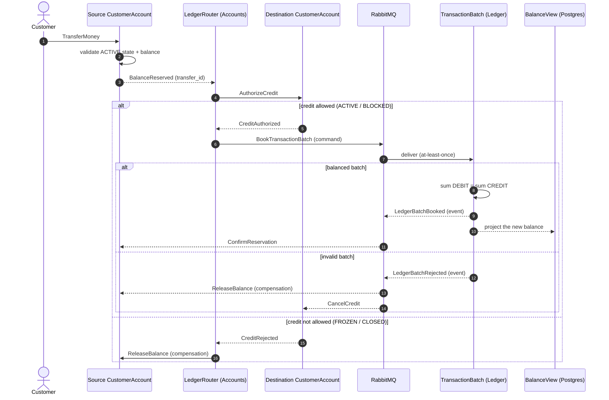
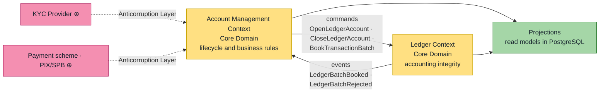

# Event Storming — Core Banking (DDD + CQRS/ES)

Design artifact for the lab in Alberto Brandolini's Event Storming format, from the *Big Picture*
down to the *Design Level*.

> **Provenance convention:** elements marked with **⊕** do not appear in the specification's event
> dictionary — they are proposals derived from the FSM, the invariants and the compensation flow.
> Everything unmarked comes straight from the spec.

---

## 1. Sticky note legend

| Color | Element | Meaning | Question it answers |
| --- | --- | --- | --- |
| 🟧 Orange | **Domain Event** | An immutable fact in the past. This is what goes into the Event Store. | What happened? |
| 🟦 Blue | **Command** | An intent to change; it may be rejected. | What was requested? |
| 🟨 Yellow | **Aggregate** | Guardian of the invariants; turns command → event. | Who decides? |
| 🟪 Lilac | **Policy / Process Manager** | "Whenever X, then Y". Asynchronous reaction. | What reacts? |
| 🟩 Green | **Read Model / Projection** | Materialized view for querying. | What gets queried? |
| 🟥 Red | **Hotspot** | Doubt, conflict or pending decision. | What don't we know yet? |
| 🟫 Pink | **External System** | Outside our bounded contexts. | Who is outside? |
| ⬜ White | **Actor / UI** | Person or interface that triggers the command. | Who starts it? |

---

## 2. Big Picture — timeline of the pivotal events

Chronological order of an account's life, ignoring command and aggregate detail.



**Pivotal events (phase dividers):** `CustomerAccountActivated` opens up transactional capability;
`CustomerAccountClosed` ends it for good. Every swing between `ACTIVE`, `BLOCKED` and `FROZEN`
happens inside the operational cycle.

---

## 3. Process Level — `Account Management Context`

Scope: account lifecycle, limits, status and business rules.
The `CustomerAccount` aggregate is implemented as an FSM.



### 3.1 FSM invariants

The specification's matrix, translated into the aggregate's guard rules:

| State | Debit (outbound) | Credit (inbound) | Allowed transitions |
| --- | :---: | :---: | --- |
| `PENDING_KYC` | ❌ | ❌ | → `ACTIVE` |
| `ACTIVE` | ✅ | ✅ | → `BLOCKED`, `FROZEN`, `CLOSED` |
| `BLOCKED` | ❌ | ✅ | → `ACTIVE`, `CLOSED` |
| `FROZEN` | ❌ | ❌ | → `ACTIVE` |
| `CLOSED` | ❌ | ❌ | terminal |

- `ReserveBalance` only produces `BalanceReserved` if the state is `ACTIVE` **and** there is
  available balance; otherwise, `BalanceReservationRejected` ⊕.
- A transition not covered by the matrix produces no event — the command is rejected
  (`{:error, reason}`) and never written to the Event Store.
- `FROZEN` is the only state that blocks credit **and** debit; `BLOCKED` blocks debit only.

---

## 4. Process Level — `Ledger Context`

Scope: immutable double-entry ledger. `Ledger` knows no other context: it takes commands and
publishes its own events (D3, D5).



### 4.1 The critical invariant

```
sum(Amount of all DEBITs) - sum(Amount of all CREDITs) = 0
```

Validated **inside** the `TransactionBatch` aggregate, before emitting `LedgerBatchBooked`.
An unbalanced batch is never persisted as a success event — it becomes
`LedgerBatchRejected` ⊕, which is the trigger for compensation.

---

## 5. Design Level — end-to-end `TransferMoney` flow

Detail of the flow in section 5 of the specification, including the failure path, as refined by
D3 and D5: the saga lives in `Account Management`, the destination account authorizes the credit,
and `Ledger` only receives a command.



### 5.1 Time sequence — success and compensation



The reservation in `Account Management` is the mechanism that replaces the distributed
transaction: between `BalanceReserved` and `ReservationConfirmed`/`BalanceReleased` the system sits
in eventual consistency, and the `transfer_id` is what stitches the saga together (D17).

---

## 6. Context Map



`Account Management` and `Ledger` relate to each other through **asynchronous messages**, with no
synchronous call and no shared database. `Ledger` is an **Open Host Service**: it publishes a
command contract and its own events, and knows nothing of `Account Management`, which conforms to
that contract. The dependency runs one way only (D3, D5).

---

## 7. Inventory of commands, events and aggregates

### Account Management

| Command | Aggregate | Success event | Rejection event/error | Guard |
| --- | --- | --- | --- | --- |
| `OpenCustomerAccount` ⊕ | `CustomerAccount` | `CustomerAccountOpened` | account already exists | — |
| `ActivateCustomerAccount` ⊕ | `CustomerAccount` | `CustomerAccountActivated` | rejected | state = `PENDING_KYC` |
| `BlockCustomerAccount` ⊕ | `CustomerAccount` | `CustomerAccountBlocked` | rejected | state = `ACTIVE` |
| `UnblockCustomerAccount` ⊕ | `CustomerAccount` | `CustomerAccountUnblocked` | rejected | state = `BLOCKED` |
| `FreezeCustomerAccount` ⊕ | `CustomerAccount` | `CustomerAccountFrozen` ⊕ | rejected | state = `ACTIVE` |
| `UnfreezeCustomerAccount` ⊕ | `CustomerAccount` | `CustomerAccountUnfrozen` ⊕ | rejected | state = `FROZEN` |
| `CloseCustomerAccount` ⊕ | `CustomerAccount` | `CustomerAccountClosed` ⊕ | rejected | state ∈ {`ACTIVE`, `BLOCKED`}, zero available balance, no open reservation, no pending credit (D8) |
| `ReserveBalance` ⊕ | `CustomerAccount` | `BalanceReserved` | `BalanceReservationRejected` ⊕ | `ACTIVE` + available balance |
| `ConfirmReservation` ⊕ | `CustomerAccount` | `ReservationConfirmed` ⊕ | — | reservation exists |
| `ReleaseBalance` ⊕ | `CustomerAccount` | `BalanceReleased` ⊕ | — | reservation exists |
| `AuthorizeCredit` ⊕ | `CustomerAccount` | `CreditAuthorized` ⊕ | `CreditRejected` ⊕ | matrix allows credit: `ACTIVE`, `BLOCKED` (D5) |
| `PostCredit` ⊕ | `CustomerAccount` | `CreditPosted` ⊕ | — (a posted `transfer_id` is ignored, D4) | none: mirrors a credit the Ledger booked (D2) |
| `CancelCredit` ⊕ | `CustomerAccount` | `CreditCancelled` ⊕ | — (an unknown `transfer_id` is ignored, D4) | pending credit exists |

The guards above are business rules, checked by the aggregate. What a command must carry (a
`customer_id`, a reason to block or freeze, a positive amount, a destination other than the
source) is checked before dispatch (D14).

A lifecycle command other than `OpenCustomerAccount` on an account that was never opened is
rejected as `account_not_found` rather than `invalid_transition`, which the API returns as 404
(D12).

### Ledger

| Command | Aggregate | Success event | Rejection event | Invariant |
| --- | --- | --- | --- | --- |
| `BookTransactionBatch` ⊕ | `TransactionBatch` | `LedgerBatchBooked` | `LedgerBatchRejected` ⊕ | sum DEBIT = sum CREDIT, entries only to `OPEN` ledger accounts |
| `OpenLedgerAccount` ⊕ | `LedgerAccount` ⊕ | `LedgerAccountOpened` ⊕ | — (an existing account ignores it, D4) | — |
| `CloseLedgerAccount` ⊕ | `LedgerAccount` ⊕ | `LedgerAccountClosed` ⊕ | account not found (a closed account ignores it, D4) | state = `OPEN` |

### Policies

| Trigger | Policy | Command issued |
| --- | --- | --- |
| `BalanceReserved` | `LedgerRouter` (Accounts) | `AuthorizeCredit` ⊕ on the destination account |
| `CreditAuthorized` ⊕ | `LedgerCommandsPublisher`, the outbox (Accounts) | `BookTransactionBatch` ⊕, sent to `Ledger` |
| `CreditRejected` ⊕ | `LedgerRouter` (Accounts) | `ReleaseBalance` ⊕ on the source, unless it is a bank account |
| `CustomerAccountOpened` / `Closed` | `LedgerCommandsPublisher` (Accounts) | `OpenLedgerAccount` / `CloseLedgerAccount` ⊕, sent to `Ledger` |
| `LedgerBatchBooked` / `Rejected` | `LedgerEventsPublisher`, the outbox (Ledger) | published on `ledger.events` |
| `LedgerBatchBooked` | `LedgerEventsInbox` (Accounts) | `ConfirmReservation` ⊕ on each debited and `PostCredit` ⊕ on each credited customer account |
| `LedgerBatchRejected` | `LedgerEventsInbox` (Accounts) | `ReleaseBalance` ⊕ on each debited and `CancelCredit` ⊕ on each credited customer account |
| Inbound PIX | `POST /api/accounts/{id}/deposits`, standing in for the ACL (D13) | `AuthorizeCredit` ⊕ from the PIX settlement account |
| KYC approved | account activation ⊕ | `ActivateCustomerAccount` ⊕ (today through the back-office endpoint) |

### Read models

Each table has a single owning projector (D11).

| Projection | Service · table | Projector | Fed by | Use |
| --- | --- | --- | --- | --- |
| `AccountStatusView` ⊕ | Accounts · `customer_accounts`, `customer_account_status_changes` | `CustomerAccountsProjector` | lifecycle events, plus `BalanceReserved`, `BalanceReleased`, `CreditPosted` | FSM status and history, available balance |
| `ReservationsView` ⊕ | Accounts · `reservations` | `ReservationsProjector` | `BalanceReserved`, `BalanceReservationRejected`, `ReservationConfirmed`, `BalanceReleased` | every reservation and how it settled |
| `CreditsView` ⊕ | Accounts · `credits` | `CreditsProjector` | `CreditAuthorized`, `CreditRejected`, `CreditPosted`, `CreditCancelled` | pending credits (D8) and how each settled |
| `LedgerAccountsView` ⊕ | Ledger · `ledger_accounts` | `LedgerAccountsProjector` (strong consistency) | `LedgerAccountOpened`, `LedgerAccountClosed` | open ledger accounts, for the D5 check |
| `BalanceView` | Ledger · `account_balances` | `BalancesProjector` | `LedgerBatchBooked` | debit and credit totals and balance per account |
| `StatementView` ⊕ | Ledger · `ledger_entries` | `StatementProjector` | `LedgerBatchBooked` | statement per account |
| `TrialBalanceView` ⊕ | Ledger · `trial_balance` (SQL view) | — | `account_balances` | trial balance, proof of double entry |

---

## 8. Hotspots — open decisions

Red sticky notes raised during modeling. Each one is worth an invariant test once resolved.

| # | Hotspot | Why it matters |
| --- | --- | --- |
| H1 | **Owner of the chart of accounts.** Does `Ledger` know the customer's accounting accounts, or does it receive the identifiers in the event payload? | Determines whether `CustomerAccountOpened` has to trigger the creation of accounting accounts. **Resolved → D5.** |
| H2 | **Credit into a `BLOCKED` account.** The matrix allows inbound money, but credits don't go through a reservation. Who authorizes the entry? | If `Ledger` doesn't check the status, `BLOCKED` is only enforced on debits. **Resolved → D5.** |
| H3 | **Reservation timeout.** Does a `BalanceReserved` with no matching `LedgerBatchBooked` stay pending forever? | Without expiry, available balance leaks. Calls for a scheduler or a `ReservationExpired` event. **Resolved → D6.** |
| H4 | **Idempotency.** Is `correlation_id` the deduplication key in `Ledger`? | A PubSub redelivery could book the same batch twice. **Resolved → D4, keyed by `transfer_id` since D17.** |
| H5 | **Freezing with an open reservation.** `FreezeCustomerAccount` during an in-flight saga: abort it or let it finish? | Affects the guards on `ConfirmReservation`. **Resolved → D7.** |
| H6 | **Residual balance at closure.** Does `CloseCustomerAccount` require a zero balance, or does it generate a transfer entry? | A terminal state holding a balance breaks reconciliation. **Resolved → D8.** |
| H7 | **Reversals.** An accounting batch is immutable — is a reversal a new, inverted batch? | Determines whether `LedgerBatchReversed` exists. **Model decided, implementation deferred → D9.** |
| H8 | **Projection failure.** `LedgerBatchBooked` written but `BalanceView` stale. | Needs projection replay and lag monitoring. **Replay resolved → D11; lag monitoring still open.** |
| H9 | **Event transport between services.** `accounts` and `ledger` have separate event stores, so Commanded's PubSub does not carry `BalanceReserved` or `LedgerBatchBooked` across. Broker, outbox, or a subscription to the other event store? | Nothing crosses the Context Map until this is decided — it blocks `LedgerRouter` and the saga in section 5. **Resolved → D3.** |
| H10 | **Retention of decided transfers.** `CustomerAccount` remembers every `transfer_id` it decided, so a late redelivery changes nothing (D4, D17). The set grows with every transfer of the account, in memory while its process lives (5 minutes idle) and in every snapshot. | Options: keep them in a compact form (a hash per id) plus snapshots, with no risk; or a time window, with the risk of a redelivery after it. **Open.** |

---

## 9. From the diagram to the code

Each bounded context is its own Phoenix service, with its own Postgres database for read models
and its own event store. This departs from the single `lib/core_banking/` app in section 6 of the
specification: the two contexts share no code and no database, as the Context Map in section 6
above requires.

```
apps/accounts/                     # Account Management Context
├── priv/openapi.yaml              # the HTTP API (D12)
└── lib/accounts/
    ├── aggregates/customer_account.ex  # 🟨 FSM, transition matrix (section 3.1) and guards
    ├── commands/                  # 🟦 commands (section 7)
    ├── events/                    # 🟧 events (section 7)
    ├── customer_accounts.ex       # context entry point for the API (D12)
    ├── command.ex                 # the macro every command uses: fields, constructor, input rules (D14)
    ├── middleware/validate_command.ex  # checks each command's input rules before dispatch (D14)
    ├── bank_accounts.ex           # the bank's own ledger accounts, e.g. PIX settlement (D5)
    ├── projections/               # 🟩 read-model schemas: AccountStatusView, ReservationsView, CreditsView
    ├── handlers/                  # subscribers of the event store
    │   ├── projectors/            # 🟩 one projector per read model (D11)
    │   ├── ledger_router.ex       # 🟪 transfer saga: credit authorization, compensation (D13)
    │   └── ledger_commands_publisher.ex  # 🟪 outbox: Ledger commands to RabbitMQ (D3)
    └── messaging/                 # RabbitMQ transport: publisher, command contract, Ledger events consumer and inbox

apps/ledger/                       # Ledger Context
├── priv/openapi.yaml              # the HTTP API (D12)
└── lib/ledger/
    ├── aggregates/transaction_batch.ex  # 🟨 D = C invariant (section 4.1)
    ├── aggregates/ledger_account.ex  # 🟨 OPEN · CLOSED (D5)
    ├── ledger_entry.ex            # DEBIT/CREDIT value object
    ├── commands/ · events/        # 🟦 🟧
    ├── projections/               # 🟩 read-model schemas: LedgerAccountsView, BalanceView, StatementView, TrialBalanceView
    ├── ledger_accounts.ex · transaction_batches.ex  # context entry points for the API (D12)
    ├── middleware/open_accounts.ex  # the D5 check, before a batch reaches its aggregate
    ├── handlers/
    │   ├── projectors/            # 🟩 one projector per read model (D11)
    │   └── ledger_events_publisher.ex  # 🟪 outbox: the Ledger's events to RabbitMQ (D3)
    └── messaging/                 # RabbitMQ transport: commands consumer and inbox, event publisher
```

Each service has the same setup: Phoenix API, Ecto for the read models, Commanded with a
Postgres event store in its own database (`<App>.App`, `<App>.EventStore`), and the `mix quality`
gate. The whole flow of section 5 runs: aggregates, message transport both ways, the
`LedgerRouter` saga, the projections and the HTTP API.

**An aggregate's rules live in the aggregate.** The FSM is a transition table in
`CustomerAccount`, `{from status, event} => to status`, next to the commands it guards, rather than
a separate `state_machine.ex`, so every rule of the aggregate reads from one file. `execute/2`
emits an event only when it is a transition out of the current status, and `apply/2` follows the
same entry to the next status. Keying by event and not by target status matters: `Activate` and
`Unblock` both lead to `ACTIVE`, but from different statuses.

**Suggested implementation order:** the `CustomerAccount` FSM → the `TransactionBatch` double-entry
invariant → available balance and `ReserveBalance` in `CustomerAccount` → `AuthorizeCredit` and the
`LedgerAccount` lifecycle (D5) → message transport (D3) and the `LedgerRouter` saga wiring the two
together → projections. Every step before the transport is pure aggregate work, testable without
any infrastructure.
The specification's priority tests are exactly hotspots H2, H3 and H5, plus the mathematical
validation from section 4.1.

---

## 10. Design decisions

Decisions taken while implementing, to keep the lab close to a real service while staying lean.

### D1 · Money is an integer in cents

Amounts are integers in minor units: `10.00 BRL = 1_000`. Currency is fixed to BRL for now.

- Integer arithmetic is exact, and integers pass through the event store's JSON serializer
  unchanged (a `Decimal` would become a string).
- Two places match what payment schemes (PIX/SPB) settle, so no conversion or rounding is
  needed at their boundary.

### D2 · Two balances, one per context

| Balance | Owner | Meaning |
| --- | --- | --- |
| Ledger balance | `Ledger` | Sum of booked entries — the source of truth, shown by `BalanceView`. |
| Available balance | `CustomerAccount` | Ledger balance minus open reservations — what `ReserveBalance` checks. |

This is the authorization × posting split used by banks and card issuers. `CustomerAccount`
keeps its available balance in its own state, derived from its own events: booked credits raise
it, reservations hold it. It never queries `Ledger` synchronously.

Money enters an account the way it does in a real bank: a batch in `Ledger` debits a settlement
account (e.g. the bank's PIX account) and credits the customer, and `Accounts` learns about it
from `LedgerBatchBooked`.

### D3 · Messages cross services through RabbitMQ, with the event store as the outbox

`Ledger` knows no other context, so the two directions carry different kinds of message:

| Direction | Message | RabbitMQ | Contract |
| --- | --- | --- | --- |
| Accounts → Ledger | **commands**: `OpenLedgerAccount`, `CloseLedgerAccount`, `BookTransactionBatch` | a queue owned by `Ledger` (point to point) | defined by `Ledger` |
| Ledger → Accounts | **events**: `LedgerBatchBooked`, `LedgerBatchRejected` | a topic exchange (publish/subscribe) | defined by `Ledger` |

- In `Accounts`, the `LedgerRouter` and the other policies are Commanded event handlers with a
  durable subscription on its own event store. They turn its facts into `Ledger` commands and
  publish them. If publishing fails, the subscription does not advance and the message is sent
  again: the event store already is the outbox, and delivery is **at-least-once**.
- In `Ledger`, a handler publishes its own events the same way.
- On each side, a Broadway consumer is only an adapter: message → command → dispatch. It holds no
  business rule.
- Only cross-context requests become commands. Domain events stay internal unless another context
  needs them, and then they are published as events.

Rejected: subscribing to the other service's event store (a shared database), distributed
Phoenix.PubSub (not durable, hides the failures this lab is about), Kafka (too heavy here).

### D4 · Consumers deduplicate by the transfer's identity

At-least-once delivery means every message may arrive twice. The consuming side deduplicates by
business identity (D17): the settlement batch's `batch_id` is derived from the `transfer_id`, so a
redelivered `BookTransactionBatch` hits a batch already decided and books nothing, and a redelivered
`LedgerBatchBooked` or `LedgerBatchRejected` finds the reservation already settled or released.

`CustomerAccount` remembers every reservation and every credit it has decided, by `transfer_id`
(`decided_reservations`, `decided_credits`). A repeated `ReserveBalance` or `AuthorizeCredit`
decides nothing, whether the first answer is still open, already settled or was a rejection. A
rejection is final: if the balance arrived or the account was unfrozen since, a new transfer comes
with a new `transfer_id`. Without this, a redelivery could reserve money twice after a
confirmation, or turn a rejected saga into an approved one. How long the decided ids are kept is
H10.

A client's retry never gets this far: the API answers it at its edge, from the `Idempotency-Key`
(D17).

### D5 · Business rules live in Accounts; Ledger accounts only open and close

- **Account status and every rule tied to it** — the FSM, the debit/credit matrix, the available
  balance and reservations — belong to `CustomerAccount`.
- **`Ledger` owns the chart of accounts** (resolves H1). A `LedgerAccount` has a minimal lifecycle,
  `OPEN` and `CLOSED`, and `Ledger` enforces a single integrity rule: no entry into an account that
  is not open. `Accounts` opens and closes the ledger account of each customer account, 1:1, by
  sending `OpenLedgerAccount` / `CloseLedgerAccount`; the bank's internal accounts (e.g. the PIX
  settlement account of D2) are opened directly in `Ledger`.
- **Credits are authorized by the destination account** (resolves H2). Before booking, the
  `LedgerRouter` sends `AuthorizeCredit` to the destination `CustomerAccount`, which applies the
  matrix: `ACTIVE` and `BLOCKED` accept credit, anything else emits `CreditRejected` and the saga
  releases the reservation. Debit and credit are then symmetric: each account that moves money is
  asked through its own aggregate.
- The "open ledger account" check runs in `Ledger`'s dispatch pipeline, against a projection of
  open ledger accounts, before the command reaches `TransactionBatch`, which stays a pure function
  of its entries.

Rejected: keeping status in `Ledger` and projecting it into `Accounts`. Status is a fact about the
customer relationship (fraud, court orders, KYC); in a shared ledger account it would spread one
customer's freeze to others, and `ReserveBalance` would authorize debits on an asynchronous copy of
the status. The realistic "many people, one balance" case is a joint account: one
`CustomerAccount` with many holders, still 1:1 with its ledger account.

### D6 · Reservations do not expire (H3)

A reservation waits for its answer from `Ledger` with no timeout. The outbox and at-least-once
delivery of D3 guarantee that every `BookTransactionBatch` is eventually answered with
`LedgerBatchBooked` or `LedgerBatchRejected`, so a reservation that stays open means something is
broken in the pipeline: an operational alert, not a domain rule.

Rejected: expiring the reservation. If `Ledger` booked the batch after the expiry, the
confirmation would find no reservation and the available balance would stay higher than the ledger
balance. Doing it right (card-style late settlement) needs expired reservations in the state and
one more race; it is not worth it while the pipeline guarantees an answer.

### D7 · Freezing lets a transfer in flight finish (H5)

`FreezeCustomerAccount` blocks new reservations (debit) and new credit authorizations, but what was
authorized before the freeze finishes: `ConfirmReservation`, `ReleaseBalance`, `PostCredit` and
`CancelCredit` ignore the status. Aborting would mean undoing a batch `Ledger` may already have
booked.

### D8 · An account closes only when it is empty (H6)

`CloseCustomerAccount` is rejected while money is in the account or on its way:

| Rejection | Condition |
| --- | --- |
| `:balance_not_zero` | available balance above zero |
| `:open_reservations` | an outbound transfer is in flight |
| `:pending_credits` | an authorized credit has not been posted yet |

The customer moves the balance out before closing. To know about credits on their way,
`CreditAuthorized` records a pending credit, which `CreditPosted` settles and `CancelCredit`
drops when `Ledger` rejects the batch.

### D9 · A reversal is a new, inverted batch (H7) — deferred

A booked batch is never changed. A reversal will be a new `TransactionBatch` with every entry
inverted and a `reversal_of` field pointing to the original, and a batch can be reversed once.
Nothing needs it yet — every rejection in the current flow happens before booking — so it is
implemented when returns (PIX) or corrections appear.

### D10 · RabbitMQ topology: the receiver owns its queue

Commands to `Ledger` travel point to point on the `ledger.commands` queue, which `Ledger`
declares and owns; senders publish through the default exchange with the queue name as routing
key.

| Concern | Decision |
| --- | --- |
| Message format | Command `type` and `message_id` as AMQP properties; the payload as a persistent JSON body |
| Publish succeeded | Only once the broker took the message: publisher confirms, plus `mandatory`, so a message no queue takes fails with `:unroutable` instead of vanishing. The outbox (D3) then retries it |
| Failed message | Rejected without requeue and dead-lettered to `ledger.commands.dead`: unknown command, invalid JSON or a command the aggregate refuses cannot loop, and stays available to inspect and replay |
| Ordering | A single processor consumes the queue, so a `CloseLedgerAccount` is never handled before the `OpenLedgerAccount` of the same account |

Sending to a queue that does not exist yet fails and is retried, so `Accounts` can start before
`Ledger` without losing messages.

### D11 · Projections read their own event store, never RabbitMQ

Each service projects only its own events, from its own event store into its own read-model
database. RabbitMQ stays for messages between contexts (D3).

```
Accounts.EventStore ──┬─> LedgerCommandsPublisher ──> RabbitMQ   (outbox, D3)
                      ├─> CustomerAccountsProjector ──> accounts_dev
                      ├─> ReservationsProjector     ──> accounts_dev
                      └─> CreditsProjector          ──> accounts_dev
```

- The publisher and each projector are **independent** durable subscriptions to the same event
  store: a broker outage does not stall the read models, and a broken projection does not stall
  the saga.
- Projectors use `commanded_ecto_projections`: each event's `Ecto.Multi` runs in the same
  transaction that records the last event seen in `projection_versions`, so a redelivered event
  is projected once.
- **Each table has a single owning projector**, and there are no foreign keys between tables of
  different projectors, so any read model can be rebuilt on its own.
- **Rebuilding (H8):** `mix commanded.reset --app <App> --handler <name>`, run inside the node
  where the projector runs. The projector's `before_reset/0` empties its tables and its
  `projection_versions` row, then the subscription replays from the origin. The subscription's
  position lives in the event store, so deleting rows alone replays nothing.
- Events carry no timestamp: the `*_at` columns come from the event's `created_at` metadata.
- The aggregate decides each reservation and credit once (D4), so `reservations` and `credits`
  get one insert per `transfer_id`. The only upsert is `CreditPosted`, for a credit posted with
  no authorization first.
- `ledger_accounts` is strongly consistent: a command dispatched with `consistency: :strong`
  returns only once the account shows up, which the D5 check relies on.
- `account_balances` keeps both totals, and the balance is a generated column
  `credit_total - debit_total`, so no sign convention per kind of account is needed: the PIX
  settlement account goes negative, a customer's account positive. `trial_balance` is a SQL view
  over it rather than another copy of the data.
- Tests call each projector directly at the `DataCase` layer; the projector processes do not
  start in the test environment (`start_projections: false`), because the test event store is
  shared.

### D12 · The HTTP API: people send commands to Accounts, and the Ledger is read-only

The API is described by OpenAPI 3.1 specs, one per service: `apps/accounts/priv/openapi.yaml` and
`apps/ledger/priv/openapi.yaml`. `docker compose up -d` serves both at http://localhost:8080 (Swagger UI).
The specs are written by hand and are the source of truth; nothing generates them from code.
An operation marked `x-planned: true` is not built yet.

- **Contract tests.**
  - Every controller test calls `assert_response_schema(conn, status)`. The helper finds the
    operation through the Phoenix route and checks that the spec documents the status. It then
    validates the body against that operation's schema with JSV, which supports JSON Schema
    2020-12 and therefore OpenAPI 3.1.
  - A second test requires the router to serve exactly the spec's operations, apart from the
    planned ones.
- **Controllers call a context entry point:** `Accounts.CustomerAccounts`,
  `Ledger.LedgerAccounts`, `Ledger.TransactionBatches`. The context builds each command from the
  request params with ExConstructor, dispatches it, and runs the read-model queries.

- **Only commands a person starts are exposed:** opening an account, the back-office lifecycle
  transitions (`POST /api/accounts/{id}/block`, `/freeze`, …), and `POST /api/transfers`. Saga
  steps (`ReserveBalance`, `AuthorizeCredit`, `ConfirmReservation`, …) stay internal to the
  saga and RabbitMQ.
- **The Ledger has no write endpoint.** Its commands arrive only through its RabbitMQ contract
  (D3, D10), so HTTP cannot book an entry around `Accounts`' rules (D5).
- **Accounts names each transfer and deposit with a `transfer_id`** (D17). The response is
  `202 Accepted` with it, and the outcome is read from `GET /api/transfers/{transfer_id}`, which
  combines the `reservations` and `credits` rows. The `Idempotency-Key` header only answers a
  retry: the same key from the same account, with the same body, returns the same transfer for
  24 hours, and starts no second saga.
- **Queries read the read models (D11)**, so they are eventually consistent. A lifecycle command
  returns `204` rather than the new state, which the read model may not show yet.
- Errors extend Phoenix's shape: `{"errors": {"code": "invalid_transition", "detail": "…"}}`. An
  FSM refusal is `409`. A rejected reservation or credit is `422` with its reason, and a command
  that breaks its input rules is `422 validation_failed`, with `fields` listing the messages for
  each field (D14).
- In dev, `accounts` listens on 4000 and `ledger` on 4001, so both can run side by side.

### D13 · The saga is stateless: every event names the other account

`BalanceReserved` carries the destination (`to_account_id`), and `CreditAuthorized` and
`CreditRejected` carry the source (`from_account_id`). Each step of section 5 then follows from one
event alone, so the `LedgerRouter` is a plain Commanded event handler rather than a process manager
with state per `transfer_id`.

- `BalanceReserved` → `AuthorizeCredit` on the destination. `CreditRejected` →
  `ReleaseBalance` on the source.
- The outbox books each `CreditAuthorized` as a `BookTransactionBatch` whose `batch_id` is
  derived from the `transfer_id` (D4, D17).
- **The Ledger's answer comes back through RabbitMQ.** `LedgerEventsPublisher` publishes
  `LedgerBatchBooked` and `LedgerBatchRejected`, with their entries, on the `ledger.events` topic
  exchange. Accounts binds its own queue, `accounts.ledger-events`, with a dead-letter queue
  (D10). `LedgerEventsInbox` turns each entry of a customer account into the saga's last step.
  A rejection carries its entries, so Accounts knows whom to compensate without keeping state.
- **The D5 check** is the `OpenAccounts` dispatch middleware. It notes the accounts of a batch
  that are missing from the open ledger accounts projection, and `TransactionBatch` rejects the
  batch as `account_not_open`. The Ledger's inbox opens and closes accounts with strong
  consistency, so the next batch on the queue sees them.
- **Money comes in as an authorized credit from the bank's PIX settlement account.**
  `POST /api/accounts/{id}/deposits` stands in for the payment scheme's anticorruption layer.
  The deposit reuses `AuthorizeCredit`, so a frozen account refuses a PIX. The booked batch debits
  `pix-settlement`, which the Ledger's seeds open (D5), and credits the customer.
  `Accounts.BankAccounts` lists the bank's accounts, so no command is sent to a `CustomerAccount`
  for them.
- **Events recorded before a field existed are still handled.** The policies start from the
  origin of the event store. A reservation that names no destination is released (D6), since no
  saga can finish it. A rejected credit with no source has nothing to release. A `PostCredit`
  for an account that was never opened fails, so its message is dead-lettered instead of
  posting into nothing.

Rejected: a process manager holding the transfer's accounts per `transfer_id`. It would keep
state that the events can carry, and it would still need the Ledger's answer delivered to it
through RabbitMQ.

### D14 · Input rules live in the command, business rules in the aggregate

Every command in Accounts is declared with `use Accounts.Command, fields: [...]`. The macro
defines the struct, adds a constructor from request params (ExConstructor), and makes Vex's
`validates` available, so each command states what it must carry:

```elixir
use Accounts.Command, fields: [:account_id, :amount, :transfer_id, :to_account_id]

validates :account_id, presence: true
validates :amount, by: [function: &Accounts.Command.positive_cents?/1, message: "…"]
validates :transfer_id, presence: true
validates :to_account_id, presence: true, by: [function: &Accounts.Command.other_account?/2, …]
```

- **Input rules** can be checked from the command alone: a required field, an amount that is a
  positive integer number of cents (D1), a destination other than the source, a
  `transfer_id` (D4). **Business rules** need the aggregate's state and stay in
  `CustomerAccount`: the FSM, the available balance, the credit matrix, and whether the
  account exists.
- `Accounts.Middleware.ValidateCommand`, in the Commanded router, checks every command before
  dispatch, whoever sends it: the API, the saga or the Ledger's events. An invalid command
  answers `{:error, {:validation_failed, fields}}` and never reaches the aggregate, so it records
  nothing. A rejection event (`BalanceReservationRejected`, `CreditRejected`) is only for a
  business decision.
- Vex keeps one entry per field, so all of a field's rules go in a single `validates`.
- **The Ledger keeps its checks in `TransactionBatch`.** An empty batch or an invalid amount
  has to become `LedgerBatchRejected`, so the sender hears back and compensates. A dispatch
  error would dead-letter the message and leave the reservation open (D6).

### D15 · Story tests drive the running services from outside

Each service's suite proves its rules and its own wiring, with the other service and RabbitMQ
replaced by mocks. Nothing there proves that the two sides agree on the message contract or on
the RabbitMQ topology, or that a story ends where it should once the messages cross: a
transfer completed or compensated, and both books agreeing (D2). `apps/e2e` covers that.

- **A separate Mix project, sharing no code with the services** (D3). It uses only their HTTP
  APIs and the RabbitMQ contract, as any client would, and never reads their databases.
- **Stories, not edge cases.** Each test tells a story that crosses at least one boundary: a
  deposit, a transfer, a compensation, a close, or a redelivered message. Rules stay in the
  services' unit tests (the `baby-steps-tdd` layers), so the suite stays small and runs in
  seconds.
- **Assertions state where the system ends up.** Reads come from read models (D11), so every
  read after a command goes through `eventually`, which retries until a deadline. Both books are
  checked together: the available balance in Accounts and the ledger balance.
- **Redelivery is tested for real.** A story publishes a copy of a message that was already
  handled, straight to RabbitMQ, then checks that no money moved (D4). Both consumers handle
  one message at a time (D10), so a small deposit sent after the copy, once it lands, proves the
  copy was handled.
- It runs against the dev stack, not in each service's `mix test`, so it never slows the
  red-green loop. Run it before a commit that changes a message, a saga step or an endpoint.

Rejected: Playwright. Its API client and polling assertions would fit, but it brings Node into an
Elixir reference repo, and its browser, the reason to choose it, has no UI to drive here. It is
worth reconsidering if a UI arrives.

### D16 · The load test reuses the stories' steps

A load test asks whether the stories still end where they should with many customers at once,
and how long they take. It lives in `apps/e2e` next to the stories and is told with their parts:
the same HTTP clients, the same steps (`E2E.Flows`: open, fund, wait for a transfer, check both
books), and the same RabbitMQ contract. `mix e2e.load` runs it, and `scripts/load.sh` checks the
services first. It runs against any stack that is up: the local one squeezed by
`docker-compose.load.yml`, or another server.

- **An open model.** Operations start on the clock at a fixed rate, whatever the answers, as
  customers do. The saga is asynchronous (the `202` comes before the booking), so a closed loop
  that waits for each outcome would slow down with the system and hide the backlog.
- **Two times per operation.** *Accept* is the request until its answer. *Settle* is the request
  until the outcome shows in the read model (D11). The single consumer on each queue (D10) shows
  up in *settle* and in the queue depth long before it shows in *accept*.
- **Correctness under load is the verdict.** The run fails unless every account ends with the
  balance its outcomes add up to, in both books (D2), the trial balance holds and no message was
  dead-lettered. Latency is reported, not asserted: it depends on the machine.
- **Ambiguous outcomes are settled by the key.** A request that failed on the client side may
  have reached the service. Once the queues are empty, the check sends it again with the same
  `Idempotency-Key`, as a real client would, instead of guessing: the service answers with the
  transfer it already started, or starts it then (D17).

Rejected: running the stories in a loop. ExUnit picks the concurrency, reports pass or fail
without latencies, and the stories are edge cases chosen to prove rules, not a realistic mix.
Rejected: k6. It brings metrics and thresholds for free, but the flows and the two-book check
would be rewritten in JavaScript, next to the Elixir ones they must agree with.

### D17 · Identities: aggregates, business identifiers, idempotency and lineage

It amends D4, D12 and D13. Before it, the `correlation_id` played four roles at once. It was the transfer's identity (the key of
its reservation and credit), the client's `Idempotency-Key`, the `batch_id` in the Ledger, and
the thread that tied a saga's messages together in the logs. The first is business, the second
belongs to the API, the third to the Ledger, and the last to infrastructure. Mixing them made the
deduplication look like "retry protection" when it is a business invariant, and tied the domain's
identity to a value the client picked.

**Each field lives where its reader is:**

| Who reads it | Where it lives | Fields |
| --- | --- | --- |
| 🟨 Business rules | the command or event payload | `account_id`, `transfer_id`, `batch_id`, `amount`, … |
| 🌐 The API, to answer a retry | the HTTP edge, never the domain | `Idempotency-Key` |
| 🧵 The event store and whoever audits a flow | event metadata | `correlation_id` (the conversation's root), `causation_id` (the message that caused this one) |
| 🔭 An observability backend | transport headers | `traceparent` (W3C), once tracing exists |

#### One identity per aggregate, named after its concept

Each aggregate has exactly one identity: its stream. Everything else it holds is a reference to
another identity. Every id is named `<concept>_id` in commands, events, read models and the API,
the same name for the same value everywhere. No message has a bare `id`: an event names several
identities at once, and its field names are the only documentation that travels with it.

| Aggregate | Identity (stream) | References it holds |
| --- | --- | --- |
| `CustomerAccount` | `account_id` | `transfer_id` as the local identity of its reservations and pending credits (entities inside the account); `to_account_id`, `from_account_id` |
| `LedgerAccount` | `account_id` (the customer account's, 1:1, D5) or a chart-of-accounts code for the bank's own accounts (`pix-settlement`) | — |
| `TransactionBatch` | `batch_id` | `transfer_id` (the transfer it settles); `account_id` on each entry |
| Transfer | not an aggregate: the saga stays stateless (D13) | `transfer_id` is the concept's identity, referenced by all of the above |

A command's identity field routes it, and its references say what inside the aggregate it is
about. `ConfirmReservation{account_id, transfer_id}` goes to the account `account_id` and
confirms the reservation of `transfer_id` in it.

#### What each identifier is

- **`transfer_id`: the transfer's identity.** A UUID generated by Accounts when it accepts a
  transfer or a deposit. The customer and support look a transfer up by it, and
  `GET /api/transfers/{transfer_id}` returns it. For an inbound PIX, the scheme's `endToEndId`
  is a natural external reference, kept as an attribute once the lab models it.
- **`batch_id`: the ledger entry's identity** (`Accounts.Messaging.BatchId`). A batch is an accounting entry, not the transfer:
  a transfer may lead to more than one (the reversal of D9 is a new batch). The settlement
  batch's id is derived, `UUIDv5(namespace, "settlement:" <> transfer_id)`, so a redelivered
  command lands on the same batch. "A transfer is settled once" becomes an explicit rule instead of
  a side effect of a retry key. A client finds a transfer's batches with the Ledger's
  `GET /api/batches?transfer_id=`.
- **`Idempotency-Key`: an API contract.** The same key from the same client returns the same
  `transfer_id`. Accounts keeps a table `idempotency_keys(scope, key, transfer_id, fingerprint,
  inserted_at)` keyed by `(scope, key)`, where the scope is the source account (the receiving one
  for a deposit) until the API has clients of its own. The fingerprint is the operation and its
  body. The command's input rules are checked first, so an invalid request claims no key. Then an
  `INSERT … ON CONFLICT` claims the key atomically: of two requests with the same key, one inserts
  and the other reads its row. A retry dispatches again with the same `transfer_id`, which the
  aggregate decides once. The same key with another body is `422 idempotency_key_reused`, and a
  request without a key fails validation on `idempotency_key`. A row older than 24 hours is taken
  over by its next use, as a new key: a window is right here, since it guards against a client's
  retries. Nothing purges old rows yet. It is not a read model (D11): no projector owns it, and
  the edge writes it synchronously.
- **`correlation_id` and `causation_id`: lineage only.** Commanded's native metadata. The
  `correlation_id` is the id of the conversation's first command, and every hop passes it on.
  Event handlers dispatch with `correlation_id: metadata.correlation_id, causation_id:
  metadata.event_id` (`<App>.Lineage`). RabbitMQ messages carry it in the AMQP `correlation_id`
  property, never in the body. Their `message_id` is already the id of the event they were
  published from, so a consumer dispatches with the property as the correlation and the
  `message_id` as the cause. A value that is not a UUID is left out, since the event store keeps
  both as UUIDs. Handlers and consumers tag their logs with the `correlation_id`. No rule reads
  them.
- **Trace context: later, and separate.** With OpenTelemetry, `traceparent` travels in the HTTP
  and AMQP headers, and the `trace_id` may be stored in event metadata as a link to the trace.
  The two are not the same: a saga crosses queues, retries and hours, and splits into several
  traces, while its lineage in the event store stays whole.

#### A customer account's identifiers

| Identifier | Stable? | Role |
| --- | --- | --- |
| `account_id`, a UUID generated by the system | never changes or gets reused | the aggregate's identity; the other contexts reference it |
| Bank + branch + number + check digit | can change (branch migration, merger, portability) | a business identifier: the `AccountNumber` value object inside `CustomerAccount`, looked up through a read model |
| PIX keys (CPF, e-mail, phone, random) | change often | aliases for the account, in a directory of their own |
| A database autoincrement | tied to a table | persistence only: never in a message, a URL or another service |

- **The id must exist before the first write.** An event-sourced aggregate's stream is created by
  its first event, so the dispatcher needs the id first. An autoincrement only exists after an
  `INSERT`, and here the account's table is a projection. It would also expose the number of
  customers and let a client enumerate accounts.
- **A business identifier that changes is an event, not a new identity.** A branch migration is
  an `AccountNumberChanged` on the same stream, and the Ledger, the history and the reservations
  keep pointing at the same `account_id`.
- **The account number is allocated, not validated.** An aggregate cannot see the others, so it
  cannot check that a number is unique across the bank (set validation). A `Branch` aggregate
  holds a counter and hands out the next number with its check digit (mod 11), which makes the
  number unique by construction. The account number is not in the lab yet. This is the model it
  follows once it is.
- UUIDv7 is time-ordered and keeps indexes more compact than the random v4 that `Ecto.UUID`
  generates. New ids may use it, and nothing else changes.

#### Deduplication becomes a business rule (amends D4)

- `CustomerAccount` decides each `transfer_id` once: one reservation on the source, one credit
  authorization on the destination. It keeps the in-flight ones (`reservations`,
  `pending_credits`) and the decided ones. The decided ids are what makes a late redelivery
  harmless, and how long to keep them is open (**H10**).
- `TransactionBatch` decides each `batch_id` once, as today.
- A client's retry is answered at the edge by the `Idempotency-Key`, before any command.

#### Migration

The lab reset its stack's data at each step, so no stored event or message in flight was read in
the old shape. The read models kept their data through migrations that rename the
`correlation_id` columns of `reservations`, `credits` and `ledger_entries` to `transfer_id`.

A running service would not reset. It would read the old events through an upcasting serializer,
which renames `correlation_id` to `transfer_id` before the struct is built (Commanded's
`struct/2` drops unknown keys), and its consumers would accept either field in the body for one
release. It would also have to keep `batch_id = transfer_id` for the transfers started before
the switch, so a redelivery of one of them still lands on its batch.

The API changed in the order of D12: the OpenAPI specs first, then the controllers, the e2e
stories and their Postman mirror, then the load test.

#### Rejected

- **A `Transfer` aggregate per `transfer_id` as the deduplication gate.** It covers only the
  first step: the later steps are still delivered at least once, and the account that applies
  the effect has to remember what it decided either way.
- **`correlation_id = trace_id`.** It holds while a flow fits in one trace. Across queues and
  retries the trace splits, and the lineage in the event store is what stays whole.
- **The `Idempotency-Key` as the aggregate's key (today).** The client picks it, it can only be
  unique per client, and a window on it would expire the business invariant along with it.
- **A bare `id` field for every aggregate.** Messages name several identities at once, and the
  name is their only documentation.

**Open:**
- **H10**, how long `CustomerAccount` keeps the decided `transfer_id`s.
- Whether a reservation should expire, which would revisit D6. With `transfer_id`, a saga
  timeout could release the reservation, and the Ledger would refuse a late batch because the
  settlement of that `transfer_id` is already decided.

### D18 · A projector waits out the infrastructure and stops on a bug

It amends D11. The load test of D16 took Accounts down at 80 operations per second. The Postgres
container, capped at 1 CPU, saturated for a few seconds (an autovacuum on top of a checkpoint).
The pool then dropped requests that waited longer than its target, and the projectors got a
`DBConnection.ConnectionError`. Commanded's default answer to a handler's error is to stop it.
The supervisor restarted each projector on the same event, the event failed again, and past
`max_restarts` the whole application shut down. A slowdown of the database became an outage of
the service, and the event was never at fault.

The saga (`LedgerRouter`) and the outboxes (`LedgerCommandsPublisher`, `LedgerEventsPublisher`)
already retried any failure forever, with a growing delay. The projectors had no `error/3` at
all. Each projector now hands its errors to `<App>.Handlers.ProjectorFailures`, which sorts them
by what a retry can change:

| The error | Examples | What the projector does |
| --- | --- | --- |
| 🏗️ The infrastructure's | `DBConnection.ConnectionError` (pool, dropped connection); Postgrex errors of class `08` (connection), `53` (resources), `57` (shutdown, statement timeout), `40001` and `40P01` (serialization, deadlock) | Retries for as long as it takes. The delay starts at 100 ms and doubles up to 30 s |
| 🐛 The code's or the data's | anything else: a bug, a constraint the event breaks, a `FunctionClauseError` | Stops, as before. Past its restarts, the application stops with it |

- **Waiting is right for the infrastructure.** The event is valid and the database comes back.
  Skipping it would leave the read model wrong without a sign. Stopping gives the outage above.
  Meanwhile the subscription stays on that event, since a projection is applied in order. It
  shows as the subscription's lag on the dashboard, and each attempt logs a warning with its
  number.
- **Crashing is right for a bug.** The same event fails the same way every time, so no retry
  helps, and skipping it would serve a read model that silently lacks an event. A service that
  dies on a new release is what a container manager can act on: it sees the release fail its
  health check and rolls back to the previous one, which projects the event as before. The
  event store keeps the event (D11), so nothing is lost while the fix ships.

Rejected: parking the event in a dead-letter table and moving on. It keeps the service up, but
with a read model that lacks the event until someone replays it, and it has to write to the same
database whose failure it may be handling. Rejected: a larger pool. The pool was not the
bottleneck: the database's CPU was, and more connections would have run more queries on the same
CPU, each slower. The pool of 10 caps the concurrency the database has to serve. Rejected: longer
`queue_target` and `queue_interval` alone. They trade a dropped request for a longer wait, which
rides out a spike but not a sustained overload, and the projectors would still stop at the first
drop.

**Open:** a container manager with health checks and automatic rollback, which the local stack
does not have. Whether the saga and the outboxes should also stop on a failure that no retry can
fix, instead of retrying it forever.
